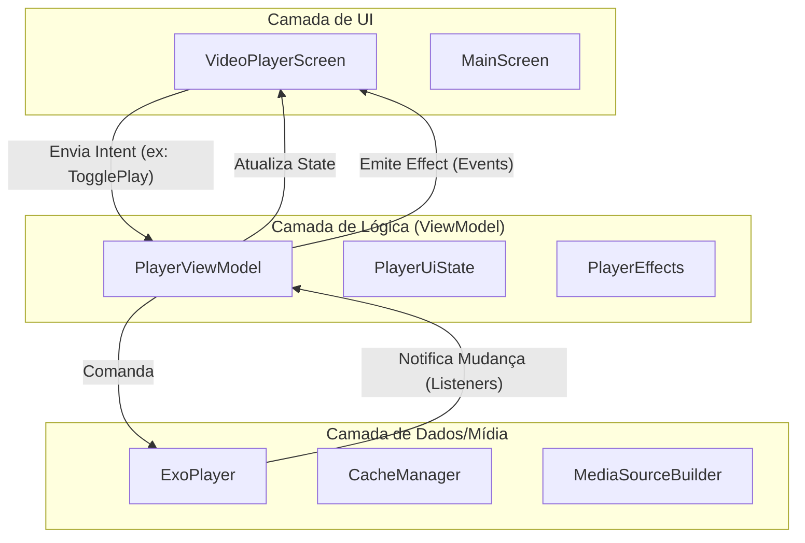

# 📱 Guia de Engenharia: Reprodutor de Mídia com Media3 e Compose

Este documento foi elaborado para servir como referência técnica de alto nível para desenvolvedores que desejam entender e implementar um sistema de reprodução de vídeo robusto em Android. O projeto utiliza as tecnologias mais modernas: **Jetpack Compose**, **Media3 (ExoPlayer)** e arquitetura **MVI**.

---

## 🏛️ 1. Arquitetura do Sistema

Como um Engenheiro Sênior, escolhi a arquitetura **MVI (Model-View-Intent)** para este projeto. Ela garante que o estado da UI seja a "única fonte da verdade", facilitando o debug e testes.

### Fluxo de Dados (MVI)


---

## 🚦 2. Intents, Listeners e Eventos

Para um desenvolvedor Junior, entender como o código "escuta" e "reage" é fundamental. No nosso `PlayerViewModel`, temos uma separação clara entre o que o usuário quer fazer (Intents) e como o sistema responde (Listeners).

### 2.1 Intents (O que o usuário deseja)
As `PlayerIntent` são classes seladas que representam ações discretas. 
*   **`TogglePlayPause`**: Inverte o estado de reprodução atual.
*   **`SeekTo(positionMs)`**: Move o vídeo para um ponto específico.
*   **`LoadMediaList(config)`**: Configura e prepara o player com novos vídeos.
*   **`NextItem / PreviousItem`**: Navegação na playlist.

### 2.2 Listeners (O que o Player nos diz)
O segredo da integração reside no `Player.Listener`. Ele é nossa ponte entre o motor de vídeo (ExoPlayer) e a interface.

```kotlin
private fun attachPlayerListeners() {
    _player.addListener(object : Player.Listener {
        // Acionado quando o play/pause muda (via sistema ou código)
        override fun onIsPlayingChanged(isPlaying: Boolean) {
            _uiState.value = _uiState.value.copy(isPlaying = isPlaying)
        }

        // Acionado quando o estado de carregamento muda
        override fun onPlaybackStateChanged(state: Int) {
            _uiState.value = _uiState.value.copy(
                isBuffering = state == Player.STATE_BUFFERING
            )
            // DETECTOR DE FIM DE CONTEÚDO:
            if (state == Player.STATE_ENDED) {
                viewModelScope.launch {
                    _effects.emit(PlayerEffect.OnPlaylistEnded)
                }
            }
        }
    })
}
```

### 2.3 Detector de Fim de Conteúdo (`STATE_ENDED`)
Este é um ponto crítico para aplicações de vídeo (ex: TikTok, Instagram Reels). Quando o `state` chega em `Player.STATE_ENDED`, o vídeo terminou.
No projeto, reagimos a isso emitindo um `PlayerEffect.OnPlaylistEnded`. 
*   **Uso Prático**: Você pode usar este evento para disparar um "Auto-play" do próximo vídeo, fechar a tela de player, ou mostrar uma tela de sugestões.

---

## 🛠️ 3. Deep Dive: Componentes Core

### 3.1 Gerenciamento de Cache (`CacheManager.kt`)
**Por que é um Singleton?** O `SimpleCache` do Media3 exige que apenas uma instância acesse o diretório de cache por vez. Múltiplas instâncias causariam erros de "Cache lock".

*   **`@Volatile`**: Garante que as mudanças nas variáveis `simpleCache` e `okHttpClient` sejam visíveis instantaneamente para todas as threads.
*   **`synchronized(lock)`**: Implementa o padrão *Double-Checked Locking* para garantir que o cache seja inicializado apenas uma vez.

### 3.2 O Cérebro: `PlayerViewModel.kt`
Herdamos de `AndroidViewModel` para ter acesso ao `Application Context` necessário para inicializar o player e o cache com segurança.
*   **`StateFlow` vs `SharedFlow`**:
    *   **`StateFlow (uiState)`**: Mantém o estado. Se a tela girar, a UI sabe instantaneamente se o vídeo estava em 01:30 ou pausado.
    *   **`SharedFlow (effects)`**: Para eventos que não devem ser repetidos (como o evento de "Fim de Vídeo"). Se você girar a tela, não queremos que o aplicativo tente pular para o próximo vídeo novamente.

---

## 📺 4. Interface Adaptativa (`VideoPlayerScreen.kt`)

A UI foi projetada para ser resiliente.
*   **`DisposableEffect`**: Essencial! Garante que, se o Composable sair da tela, o player pare de consumir recursos e bateria.
*   **Full-Screen Landscape**: O código detecta a orientação e utiliza `WindowInsetsControllerCompat` para esconder as barras de sistema, garantindo imersão total.

---

## 📝 5. O Manifesto e Ciclo de Vida

No `AndroidManifest.xml`, a configuração da Activity é crucial:
```xml
<activity
    android:name=".MainActivity"
    android:configChanges="orientation|screenSize|smallestScreenSize|screenLayout">
```
**Dica de Sênior:** Sem isso, o `ExoPlayer` seria destruído a cada rotação, causando "pulos" no áudio e recarregamento do vídeo, o que destrói a retenção do usuário.

---

## 🚀 6. Como Reutilizar em Outros Projetos

### Exemplo: Reagindo ao Fim do Vídeo na sua Activity

```kotlin
// Dentro de um Composable
val viewModel: PlayerViewModel = viewModel()

LaunchedEffect(Unit) {
    viewModel.effects.collect { effect ->
        when (effect) {
            is PlayerEffect.OnPlaylistEnded -> {
                println("O vídeo acabou! Lógica de auto-play aqui.")
            }
            is PlayerEffect.ShowErrorToast -> {
                // Mostrar erro para o usuário
            }
        }
    }
}
```

### Personalizando os Controles
O `VideoPlayerScreen` aceita um slot `controlsContent`, permitindo que você mude toda a UI sem tocar na lógica do player.
