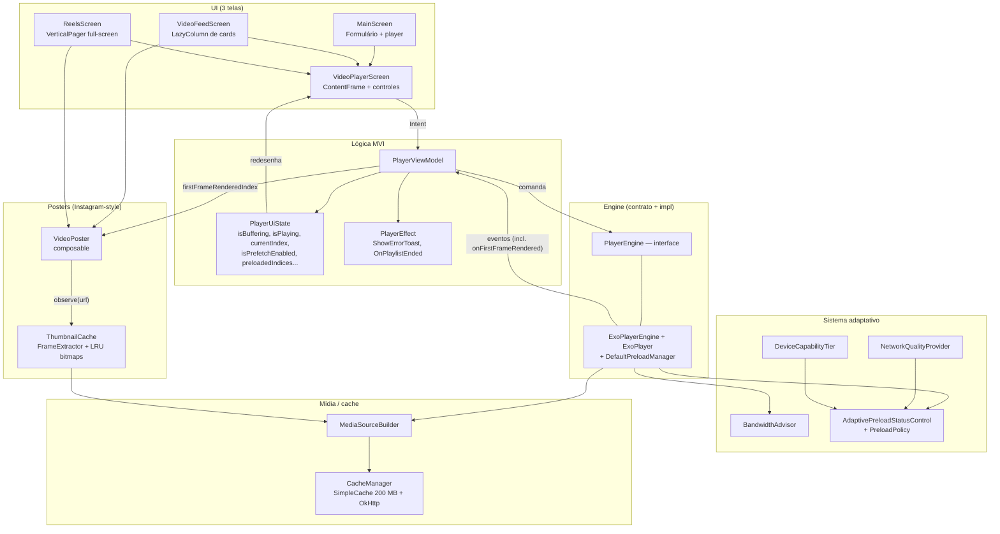

# 📱 Player de Vídeo Android — Guia Completo para Devs Júniors

> **Para quem é este guia?**
> Este documento foi escrito pensando em você que está aprendendo Android e quer entender como funciona um player de vídeo de verdade — com cache, preload, feed vertical, Reels, controle adaptativo por rede e por capacidade do device. Não assumimos que você já sabe tudo: cada conceito novo vem com uma explicação em português simples e, sempre que houver uma decisão de projeto, a gente explica **por que** foi feita daquele jeito.

---

## 📌 O que este projeto faz?

É um **app Android de reprodução de vídeo** organizado em três telas, todas reusando o mesmo "motor de player":

1. **MainScreen** — formulário para colar uma URL (HLS/DASH), opção de cortar a duração, e o player com controles.
2. **Feed (cards)** — `LazyColumn` vertical com 30 cards de vídeo. O card mais visível dispara o autoplay; vizinhos são pré-carregados.
3. **Reels** — feed full-screen com swipe vertical (`VerticalPager`), portrait travado, imersivo, toque pausa/retoma. Estilo TikTok/Instagram Reels.

Sob o capô há um **sistema adaptativo** que olha para a rede (Wi-Fi/4G/3G/offline), para a RAM do device (LOW/MID/HIGH) e para o bandwidth medido em tempo real, ajustando preload e buffer dinamicamente.

No Feed e no Reels o app ainda mostra um **poster com o 1º frame do vídeo** estilo Instagram (extraído em runtime via `FrameExtractor` do Media3) enquanto o vídeo não está tocando, e **retoma a reprodução de onde parou** ao voltar para um item já visto na sessão.

---

## 🛠️ Tecnologias Usadas

| Tecnologia | O que faz neste projeto |
|---|---|
| **Kotlin** | Linguagem principal. |
| **Jetpack Compose** | Cria a interface visual (telas, listas, pager) sem XML. |
| **Media3 / ExoPlayer 1.10.1** | Motor de playback. Inclui `DefaultPreloadManager` para preload. |
| **Media3 `inspector-frame`** | `FrameExtractor` para extrair o 1º frame dos vídeos como poster (estilo Instagram), reusando o mesmo cache LRU do player. |
| **Jetpack Navigation 3** | Navegação entre as três telas, com `ViewModelStore` por destino. |
| **Arquitetura MVI** | `Intent` → `ViewModel` → `State`/`Effect` → `View`. |
| **Material Design 3 Expressive** | Sistema de design (cores, tipografia, formas) e controles (`ProgressSlider`, `PlayPauseButton`, etc.) do Media3-compose-material3. |
| **OkHttp** | HTTP customizado com User-Agent (necessário para muitos CDNs). |
| **SimpleCache (LRU 200 MB)** | Cache de disco compartilhado entre playback **e** preload. |
| **JUnit 4 + kotlinx-coroutines-test** | Testes unitários JVM do `PlayerViewModel` (sem emulador). |

---

## ✅ Pré-requisitos

- **Android Studio** Ladybug 2024.2 ou mais recente — [developer.android.com/studio](https://developer.android.com/studio).
- **JDK 11+** (o Android Studio já vem com um JDK).
- **Android SDK 26+** (Android 8.0+).
- Conhecimento básico de Kotlin e Jetpack Compose.

> 💡 **Nunca usou Compose?** Pense em Compose como HTML, mas em Kotlin: em vez de `<Button>`, você escreve `Button { Text("Clique") }`. O Compose **recompõe** (redesenha) sozinho quando o estado muda.

---

## 🚀 Como Rodar o Projeto

1. **Abra o projeto** no Android Studio (`File > Open`, selecione a pasta `Player`).
2. **Aguarde o sync do Gradle** — pode demorar na primeira vez (baixa dependências).
3. **Crie um emulador** (Pixel 6, API 33+) ou conecte um dispositivo físico.
4. **Execute** com ▶️ (`Shift + F10`).
5. Na tela principal, a URL de teste (`https://test-streams.mux.dev/x36xhzz/x36xhzz.m3u8`) já vem preenchida. Aperte **Carregar e Reproduzir** ou navegue para **Ver lista de vídeos** / **Ver Reels**.

---

## 🎬 As Três Telas

```
┌────────────────┐   ┌────────────────┐   ┌────────────────┐
│  Player        │   │  Lista...      │   │   (sem chrome) │
│                │   │┌──────────────┐│   │                │
│  🔗 URL [    ] │   ││ Vídeo #1     ││   │     ▓▓▓▓▓▓     │
│  ☐ Cortar      │   ││  ▓▓▓▓▓▓▓▓▓▓  ││   │     ▓▓▓▓▓▓     │ ← VerticalPager
│  [▶ Reproduzir]│   │└──────────────┘│   │     ▓▓▓▓▓▓     │   (1 página por swipe)
│  [Lista ↓]     │   │┌──────────────┐│   │     ▓▓▓▓▓▓     │
│  [Reels ↓]     │   ││ Vídeo #2     ││   │                │
│ ───────────────│   ││  ▓▓▓▓▓▓▓▓▓▓  ││   │                │
│                │   │└──────────────┘│   │                │
│   ÁREA PLAYER  │   │ ...            │   │  (toque = ⏯)   │
│  ▶ ◀ ▶▶  01:30 │   │                │   │                │
└────────────────┘   └────────────────┘   └────────────────┘
   MainScreen          VideoFeedScreen        ReelsScreen
```

- **MainScreen** (landscape vira tela cheia imersiva).
- **VideoFeedScreen** (`LazyColumn` — rolagem livre; autoplay do card mais visível com debounce de 250 ms).
- **ReelsScreen** (`VerticalPager` com snap — uma página por swipe; portrait travado escopado à tela; sai do escopo → libera rotação).

---

## 📁 Estrutura de Pastas

```
Player/
├── app/src/main/java/br/com/player/
│   │
│   ├── MainActivity.kt                ← Entry point + Navigation 3 (3 telas).
│   │                                    Libera o cache do app no onDestroy.
│   │
│   ├── player/
│   │   ├── PlayerConfig.kt            ← Data classes: MediaItemConfig, CacheConfig,
│   │   │                                BufferConfig, PlayerConfig (+ forcePlaylistMode).
│   │   ├── CacheManager.kt            ← Singleton: SimpleCache (LRU 200 MB) + OkHttp
│   │   │                                singleton + CacheDataSource.Factory.
│   │   ├── MediaSourceBuilder.kt      ← Cria MediaSource a partir de MediaItemConfig
│   │   │                                usando o factory cache-backed.
│   │   │
│   │   ├── NetworkQualityProvider.kt  ← Classifica conexão: WIFI / CELLULAR_FAST /
│   │   │                                CELLULAR_SLOW / OFFLINE (via ConnectivityManager).
│   │   ├── DeviceCapabilityTier.kt    ← Avalia RAM (LOW/MID/HIGH) → cap de preload distance.
│   │   ├── BandwidthAdvisor.kt        ← Lê DefaultBandwidthMeter e baixa o BufferConfig
│   │   │                                em redes lentas (usa base como teto, nunca aumenta).
│   │   ├── AdaptivePreloadStatusControl.kt
│   │   │                              ← TargetPreloadStatusControl que aplica a PreloadPolicy
│   │   │                                escolhida pela network tier + cap por capability tier.
│   │   │
│   │   ├── engine/
│   │   │   ├── PlayerEngine.kt        ← Interface que abstrai ExoPlayer + Preload.
│   │   │   ├── PlayerEventListener.kt ← Callbacks neutros (sem Android/Media3) para o ViewModel.
│   │   │   └── ExoPlayerEngine.kt     ← Implementação real: cria ExoPlayer, PreloadManager,
│   │   │                                injeta cache no factory, configura playlist-internal preload.
│   │   │
│   │   └── ui/
│   │       ├── PlayerViewModel.kt        ← MVI: handleIntent + uiState + effects.
│   │       │                               Decide entre prefetch (registerForPreload + playPreloadedItemAt)
│   │       │                               e playlist (loadDirect + seekToItem).
│   │       ├── PlayerViewModelFactory.kt ← Cria o VM injetando ExoPlayerEngine real.
│   │       └── VideoPlayerScreen.kt      ← UI do player (ContentFrame + controles M3 Expressive
│   │                                       com auto-hide, modo paisagem imersivo, erro com retry).
│   │
│   ├── feed/
│   │   ├── VideoFeedScreen.kt         ← LazyColumn + autoplay do card mais visível.
│   │   │                                Cards inativos mostram VideoPoster (1º frame).
│   │   └── VideoFeedMock.kt           ← 30 itens com a mesma URL HLS (Mux test stream).
│   │
│   ├── reels/
│   │   └── ReelsScreen.kt             ← VerticalPager full-screen + portrait lock + graça
│   │                                    de 300 ms no spinner. Usa forcePlaylistMode = true.
│   │                                    Empilha VideoPoster por página sobre o ContentFrame.
│   │
│   ├── thumbnail/
│   │   ├── ThumbnailCache.kt          ← Singleton (Application) que extrai o 1º frame de
│   │   │                                cada URL via Media3 FrameExtractor. LRU 24 bitmaps,
│   │   │                                downscale 360 px, dedup por URL.
│   │   └── VideoPoster.kt             ← Composable que observa o cache e renderiza o frame
│   │                                    com fade alpha tied ao parâmetro `visible`.
│   │
│   ├── util/
│   │   └── ViewModelExt.kt            ← appViewModel() e playerViewModel() helpers para
│   │                                    Navigation 3 (escopo de ViewModel por NavEntry).
│   │
│   └── ui/theme/                      ← Cores, tipografia, tema Material 3 do app.
│
├── app/src/test/java/br/com/player/   ← Testes JVM puros (sem emulador):
│   ├── MainDispatcherRule.kt
│   └── player/
│       ├── engine/FakePlayerEngine.kt ← Fake do PlayerEngine.
│       └── ui/PlayerViewModelTest.kt  ← 27 testes do ViewModel.
│
├── docs/
│   └── video-preload-cache.md         ← Spec detalhada do sistema adaptativo de preload.
│
├── gradle/libs.versions.toml          ← Version catalog centralizado.
└── app/build.gradle.kts               ← SDK, dependências.
```

---

## 🏗️ Arquitetura MVI + Camada de Engine

### O que é MVI?

**MVI** = **M**odel-**V**iew-**I**ntent. Três conceitos:

```
👤 Usuário        ──(Intent)──►   🧠 ViewModel    ──(atualiza)──►   📦 State
   tela                              processa                          imutável
                                                                          │
                                                                  (Compose redesenha)
                                                                          ▼
                                                                       👁 View
```

E um quarto: **Effect** — para eventos pontuais que **não devem se repetir** ao recompor (erros como toast, "playlist acabou"). Diferente do `State`, o `Effect` é entregue uma vez ao consumidor ativo.

### Por que adicionamos uma camada `PlayerEngine`?

O `ExoPlayer` exige `Context` Android e cria threads próprias de mídia. Se o `PlayerViewModel` falasse direto com ele, ninguém testaria o VM em JVM puro. Resolvendo:

```
PlayerViewModel  ──►  PlayerEngine (interface)
                          ▲          ▲
                          │          │
              ExoPlayerEngine    FakePlayerEngine
              (produção)         (testes JVM)
```

O VM nunca importa `androidx.media3.*` — só `PlayerEngine` + `PlayerEventListener`. Resultado: **27 testes JUnit rodam em segundos**, sem emulador.

### Diagrama completo



---

## 🔍 Componentes Core — Detalhados

### 7.1 📄 `PlayerConfig.kt` — As Fichas Técnicas

Aqui ficam as data classes que descrevem **o que carregar** e **como configurar buffer/cache**:

```kotlin
data class MediaItemConfig(
    val url: String,
    val format: MediaFormat = MediaFormat.HLS,   // HLS (.m3u8) ou DASH (.mpd)
    val clipDurationMs: Long? = null             // corte opcional (em ms)
)

enum class MediaFormat { HLS, DASH }

data class CacheConfig(
    val maxBytes: Long = 200L * 1024L * 1024L    // 200 MB de cache LRU em disco
)

data class BufferConfig(
    val minBufferMs: Int = 5_000,                       // mínimo bufferizado
    val maxBufferMs: Int = 50_000,                      // limite de buffer adiante
    val bufferForPlaybackMs: Int = 2_500,               // tempo até começar a tocar
    val bufferForPlaybackAfterRebufferMs: Int = 5_000   // idem após rebuffer
)

data class PlayerConfig(
    val mediaList: List<MediaItemConfig>,
    val cacheConfig: CacheConfig = CacheConfig(),
    val bufferConfig: BufferConfig = BufferConfig(),
    // Força playlist interna do ExoPlayer (loadDirect + seekToItem) em vez do
    // DefaultPreloadManager. Ideal para Reels: troca de item praticamente sem
    // tear-down do pipeline. Mantenha `false` para feeds normais (cards), onde o
    // DefaultPreloadManager é o caminho recomendado.
    val forcePlaylistMode: Boolean = false
)
```

> 💡 **Por que `data class`?** Kotlin gera `equals()`, `hashCode()` e `copy()` automaticamente. No MVI o `copy()` é vital: `state.copy(isPlaying = true)` produz um **novo** estado sem mutar o anterior.

> 💡 **Por que `forcePlaylistMode` existe?** O `DefaultPreloadManager` é ótimo para feeds de cards (itens distintos, autoplay quando o card mais visível muda). Mas em Reels (vídeo após vídeo, swipe sequencial) **o gargalo é o `setMediaSource + prepare()` que o caminho de prefetch executa a cada troca** — isso sempre dispara `STATE_BUFFERING` e o spinner pisca. A playlist interna do ExoPlayer + `seekToItem(index, 0L)` evita esse tear-down. Veja a seção **ReelsScreen** abaixo.

---

### 7.2 🗄️ `CacheManager.kt` — Cofre LRU + Cliente HTTP

Singleton com **três responsabilidades**:

1. **`SimpleCache` LRU de 200 MB** em `app.cacheDir/mediacache`. Compartilhado entre playback e preload (mesmos bytes não baixam duas vezes).
2. **`OkHttpClient` singleton** com retry, fallback para HTTP/1.1 (resolve `StreamReset` em alguns emuladores) e interceptor que injeta um User-Agent de browser (muitos CDNs bloqueiam clientes "anônimos").
3. **`CacheDataSource.Factory`** que combina os dois: upstream OkHttp + sink no SimpleCache, com flags `FLAG_BLOCK_ON_CACHE` (não baixa duas vezes em paralelo) e `FLAG_IGNORE_CACHE_ON_ERROR` (cache corrompido → segue baixando).

```kotlin
object CacheManager { // object = Singleton automático em Kotlin

    @Volatile private var simpleCache: SimpleCache? = null
    @Volatile private var okHttpClient: OkHttpClient? = null
    private val lock = Any()

    fun getCacheDataSourceFactory(context: Context, cacheConfig: CacheConfig, externalClient: OkHttpClient? = null) : CacheDataSource.Factory {
        val cache = getCache(context, cacheConfig)
        val client = externalClient ?: getOkHttpClient()
        val upstreamFactory = OkHttpDataSource.Factory(client)
        val cacheDataSinkFactory = CacheDataSink.Factory().setCache(cache)
        return CacheDataSource.Factory()
            .setCache(cache)
            .setUpstreamDataSourceFactory(upstreamFactory)
            .setCacheWriteDataSinkFactory(cacheDataSinkFactory)
            .setFlags(CacheDataSource.FLAG_BLOCK_ON_CACHE or CacheDataSource.FLAG_IGNORE_CACHE_ON_ERROR)
    }
}
```

**Por que `@Volatile` + `synchronized` no padrão *double-checked locking*?**
- `@Volatile` garante que cada thread vê o valor mais recente da referência (sem cache de CPU).
- O `synchronized(lock)` só é pago na primeira chamada. Depois, o `simpleCache?.let { return it }` no início escapa cedo, sem custo.

**Por que `CacheManager.release()` no `onDestroy()` do app?** O `SimpleCache` mantém um *file lock* no diretório. Se você não liberar, o próximo `SimpleCache` no mesmo processo (raro em prod, comum em desenvolvimento com hot-reload) lança `Cache is already in use`.

---

### 7.3 🏗️ `MediaSourceBuilder.kt` — Da URL ao `MediaSource`

```kotlin
object MediaSourceBuilder {

    fun createFactory(context: Context, cacheConfig: CacheConfig = CacheConfig()): DefaultMediaSourceFactory {
        val cacheDataSourceFactory = CacheManager.getCacheDataSourceFactory(context, cacheConfig)
        return DefaultMediaSourceFactory(context).setDataSourceFactory(cacheDataSourceFactory)
    }

    fun build(context: Context, config: MediaItemConfig, cacheConfig: CacheConfig = CacheConfig()): MediaSource =
        createFactory(context, cacheConfig).createMediaSource(config.toMediaItem())
}

fun MediaItemConfig.toMediaItem(mediaId: String? = null): MediaItem = MediaItem.Builder()
    .setUri(url)
    .apply { if (mediaId != null) setMediaId(mediaId) }
    .setMimeType(when (format) {
        MediaFormat.HLS -> MimeTypes.APPLICATION_M3U8
        MediaFormat.DASH -> MimeTypes.APPLICATION_MPD
    })
    .apply {
        clipDurationMs?.let {
            setClippingConfiguration(
                MediaItem.ClippingConfiguration.Builder().setEndPositionMs(it).build()
            )
        }
    }
    .build()
```

> 💡 **Por que `mediaId` é opcional?** O `DefaultPreloadManager` indexa por `MediaItem.equals`. Quando várias posições compartilham a **mesma URL** (caso dos Reels mock, com 30 cópias do test stream), sem um `mediaId` único por posição todas colapsam em uma só entrada de preload — preload morto. Setando `mediaId = index.toString()` no momento de registrar, cada posição vira um item distinto. Para o caminho normal de playback (`build`) o `mediaId` fica nulo e tudo segue funcionando.

---

### 7.4 🔌 `PlayerEngine` — A Interface

```kotlin
interface PlayerEngine {

    /** Instância Media3 — só para o ContentFrame da UI. Testes do VM não devem tocar. */
    val player: Player

    fun setEventListener(listener: PlayerEventListener)
    fun clearEventListener()

    val isPlaying: Boolean
    val currentPosition: Long
    val duration: Long
    val currentMediaItemIndex: Int

    fun play()
    fun pause()
    fun seekTo(positionMs: Long)
    fun seekToItem(index: Int, positionMs: Long = 0L)
    fun seekToNext()
    fun seekToPrevious()

    /** Caminho playlist: carrega tudo no ExoPlayer e usa seekToItem para trocar. */
    fun loadDirect(items: List<MediaItemConfig>, cacheConfig: CacheConfig)

    /** Caminho prefetch: registra os itens no DefaultPreloadManager. */
    fun registerForPreload(items: List<MediaItemConfig>)

    /**
     * Reproduz `index` usando a fonte pré-carregada (fallback: builda direto).
     * `startPositionMs` é aplicado via `seekTo` logo após `prepare()`, suportando
     * retomada de posição salva no caminho prefetch.
     */
    fun playPreloadedItemAt(
        index: Int,
        config: MediaItemConfig,
        cacheConfig: CacheConfig,
        startPositionMs: Long = 0L
    )

    fun setCurrentPreloadIndex(index: Int)
    fun invalidatePreload()
    fun resetPreload()

    /** Força preload de um índice independente da distância. */
    fun requestPreloadAt(index: Int) = Unit

    fun release()
}
```

E o contrato neutro de eventos (sem Android/Media3) que o engine reporta para o ViewModel:

```kotlin
interface PlayerEventListener {
    fun onIsPlayingChanged(isPlaying: Boolean) = Unit
    fun onPlaybackStateChanged(isBuffering: Boolean, isEnded: Boolean) = Unit
    fun onPositionChanged(positionMs: Long, durationMs: Long) = Unit
    fun onMediaItemIndexChanged(index: Int) = Unit
    fun onPreloadCompleted(index: Int) = Unit
    /** Renderizador desenhou o 1º frame do item atual — sinal para esmaecer o poster. */
    fun onFirstFrameRendered() = Unit
}
```

> 💡 **A propriedade `player: Player`** é o único vazamento controlado de tipo Media3 — necessária porque o `ContentFrame` do compose-ui-material3 da Media3 precisa de um `Player`. Em testes, o `FakePlayerEngine` lança erro se alguém tentar acessá-la (o VM nunca acessa).

---

### 7.5 🎛️ `ExoPlayerEngine.kt` — A Implementação Real

Faz três coisas centrais no construtor:

```kotlin
class ExoPlayerEngine(
    private val app: Application,
    bufferConfig: BufferConfig = BufferConfig(),
    cacheConfig: CacheConfig = CacheConfig()
) : PlayerEngine {

    // ① Bandwidth meter SINGLETON do processo — playback + preload contribuem para
    //    a mesma estimativa, e o BandwidthAdvisor lê esse mesmo objeto.
    private val bandwidthMeter = DefaultBandwidthMeter.getSingletonInstance(app)
    private val bandwidthAdvisor = BandwidthAdvisor(bandwidthMeter)

    // ② Buffer tunado com base no bandwidth medido (≤ que o BufferConfig do chamador).
    private val tunedBufferConfig = bandwidthAdvisor.recommendedBufferConfig(bufferConfig)

    // ③ Preload control com policy por network tier + cap por device capability.
    private val preloadControl = AdaptivePreloadStatusControl().also { ctrl ->
        ctrl.deviceMaxDistance = DeviceCapabilityTier.assess(app).maxPreloadDistance()
        ctrl.policy = NetworkQualityProvider(app).currentTier().toPolicy()
    }

    private val preloadBuilder = DefaultPreloadManager.Builder(app, preloadControl)
        .apply {
            setLoadControl(DefaultLoadControl.Builder()
                .setBufferDurationsMs(tunedBufferConfig.minBufferMs, ...)
                .build())
            // Cache injetado AQUI: bytes preloadados vão para o mesmo LRU de 200 MB
            // que o player ativo usa. Sem isso, preload baixa e descarta tudo.
            setMediaSourceFactory(MediaSourceBuilder.createFactory(app, cacheConfig))
        }

    private val preloadManager = preloadBuilder.build()
    private val exoPlayer = preloadBuilder.buildExoPlayer()

    init {
        exoPlayer.addListener(internalListener)
        // Playlist-internal preload (Media3 1.4+): no caminho playlist (loadDirect +
        // seekToItem), o ExoPlayer mantém os próximos itens com até 5 s prontos —
        // troca entre itens praticamente instantânea no Reels.
        exoPlayer.setPreloadConfiguration(ExoPlayer.PreloadConfiguration(5_000_000L))
    }
}
```

E os dois caminhos de carga:

```kotlin
// Caminho PLAYLIST (forcePlaylistMode = true)
override fun loadDirect(items: List<MediaItemConfig>, cacheConfig: CacheConfig) {
    exoPlayer.stop(); exoPlayer.clearMediaItems(); preloadManager.reset()
    items.forEach { item ->
        exoPlayer.addMediaSource(MediaSourceBuilder.build(app, item, cacheConfig))
    }
    exoPlayer.playWhenReady = true
    exoPlayer.prepare()   // UMA VEZ; trocas futuras são seekToItem.
}

// Caminho PREFETCH (default para 2+ itens)
override fun registerForPreload(items: List<MediaItemConfig>) {
    exoPlayer.stop(); exoPlayer.clearMediaItems(); preloadManager.reset()
    preloadControl.forcedIndices = emptySet()
    items.forEachIndexed { index, item ->
        preloadManager.add(item.toMediaItem(mediaId = index.toString()), index)
    }
    preloadManager.invalidate()
}

override fun playPreloadedItemAt(
    index: Int,
    config: MediaItemConfig,
    cacheConfig: CacheConfig,
    startPositionMs: Long
) {
    val mediaItem = config.toMediaItem(mediaId = index.toString())
    val source = preloadManager.getMediaSource(mediaItem)
        ?: MediaSourceBuilder.build(app, config, cacheConfig) // fallback
    exoPlayer.setMediaSource(source)
    exoPlayer.playWhenReady = true
    exoPlayer.prepare()
    // Retomada de posição: o seek enfileira até a timeline ficar pronta — seguro
    // logo após `prepare()`. Sem isso, retomar um item já visto recomeçaria do 0.
    if (startPositionMs > 0L) exoPlayer.seekTo(startPositionMs)
}
```

E o engine também encaminha `onRenderedFirstFrame` do `Player.Listener` para o `PlayerEventListener.onFirstFrameRendered()` — esse sinal alimenta o fade do poster (veja seção 7.12).

> 💡 **Por que dois caminhos?** Porque eles otimizam UX **diferentes**:
> - **Prefetch** (`registerForPreload` + `playPreloadedItemAt`): bom para **carrosséis com itens distintos** (Feed de cards). A cada autoplay troca a fonte do player. O cache pré-aquecido garante que o próximo item já está em disco.
> - **Playlist** (`loadDirect` + `seekToItem`): bom para **playback sequencial contínuo** (Reels). Uma única `prepare()`; trocas são apenas `seekTo(index, 0)`. Sem flash de buffering.

> 💡 **O bandwidth meter precisa ser o mesmo objeto?** Sim. Pegando o singleton do processo, todo download (playback ou preload) atualiza a mesma estimativa. O `BandwidthAdvisor` consulta esse mesmo objeto, então a rede medida pelo preload influencia o buffer do playback automaticamente.

---

### 7.6 🌐 Sistema Adaptativo (4 classes)

O preload **não é fixo**. Ele combina três sinais e converte em decisões.

#### `NetworkQualityProvider.kt` — Tier da conexão

Classifica em quatro tiers via `ConnectivityManager` + `NetworkCapabilities` (API 29+) ou `TelephonyManager` (legado):

| Tier | Critério |
|---|---|
| `WIFI` | Transporte Wi-Fi ou Ethernet. |
| `CELLULAR_FAST` | Celular com ≥ 2 Mbps downstream (API 29+) ou 4G/HSPAP (legado). |
| `CELLULAR_SLOW` | Celular com < 2 Mbps ou 3G/2G. |
| `OFFLINE` | Sem rede ativa. |

É consultado a cada troca de item (`setCurrentPreloadIndex`) — chamada barata ao OS, sem tráfego.

#### `DeviceCapabilityTier.kt` — Tier por RAM

Avalia uma vez na inicialização do engine:

| Tier | Critério | `maxPreloadDistance` |
|---|---|---|
| `LOW` | `memInfo.lowMemory == true` | 1 |
| `MID` | `totalMem < 2 GB` | 2 |
| `HIGH` | `totalMem ≥ 2 GB` | sem cap |

> 💡 **Por que cap por RAM?** Cada item preloadado mantém buffers em memória. Em um celular de 1 GB, manter +4 itens prontos pode causar OOM. O cap converte uma decisão de UX (preload agressivo) em uma decisão segura por device.

#### `BandwidthAdvisor.kt` — Tunagem do buffer

Lê `DefaultBandwidthMeter.bitrateEstimate` e **reduz** o `BufferConfig` em redes lentas, **nunca aumenta**:

| Bandwidth | `bufferForPlaybackMs` | `bufferForPlaybackAfterRebufferMs` | `maxBufferMs` |
|---|---|---|---|
| ≤ 0 ou < 500 kbps | min(base, 1 000) | min(base, 2 000) | min(base, 15 s) |
| 500 kbps – 2 Mbps | min(base, 1 500) | min(base, 3 000) | min(base, 25 s) |
| > 2 Mbps | base intacto | base intacto | base intacto |

> 💡 **Por que `base` é teto?** O `ReelsBufferConfig` define `bufferForPlaybackMs = 800` para fast-start no estilo TikTok. Se o advisor *aumentasse* esse valor em redes boas, perderíamos a intenção do chamador. Como `min(base, X)` só baixa, o fast-start é preservado.

#### `AdaptivePreloadStatusControl.kt` — A política

Implementa `TargetPreloadStatusControl<Int, DefaultPreloadManager.PreloadStatus>` do Media3, retornando para cada índice **o quanto preloadar**:

```kotlin
class AdaptivePreloadStatusControl : TargetPreloadStatusControl<Int, DefaultPreloadManager.PreloadStatus> {

    @Volatile var currentPlayingIndex: Int = 0
    @Volatile var policy: PreloadPolicy = PreloadPolicy.WIFI
    @Volatile var deviceMaxDistance: Int = Int.MAX_VALUE
    @Volatile var forcedIndices: Set<Int> = emptySet()  // bypass de distance via requestPreloadAt

    override fun getTargetPreloadStatus(rankingData: Int): DefaultPreloadManager.PreloadStatus {
        if (rankingData in forcedIndices) return PreloadStatus.specifiedRangeLoaded(3_000L)
        val distance = abs(rankingData - currentPlayingIndex)
        if (distance == 0) return PreloadStatus.PRELOAD_STATUS_NOT_PRELOADED
        val effectiveMax = minOf(policy.maxPreloadDistance, deviceMaxDistance)
        if (distance > effectiveMax) return PreloadStatus.PRELOAD_STATUS_NOT_PRELOADED
        return when (distance) {
            1 -> if (policy.distance1Ms > 0) PreloadStatus.specifiedRangeLoaded(policy.distance1Ms)
                 else PreloadStatus.PRELOAD_STATUS_TRACKS_SELECTED
            2 -> if (policy.distance2Ms > 0) PreloadStatus.specifiedRangeLoaded(policy.distance2Ms)
                 else PreloadStatus.PRELOAD_STATUS_TRACKS_SELECTED
            else -> PreloadStatus.PRELOAD_STATUS_SOURCE_PREPARED
        }
    }
}

data class PreloadPolicy(val distance1Ms: Long, val distance2Ms: Long, val maxPreloadDistance: Int) {
    companion object {
        val WIFI          = PreloadPolicy(5_000L, 2_000L, 4)
        val CELLULAR_FAST = PreloadPolicy(3_000L, 0L, 2)
        val CELLULAR_SLOW = PreloadPolicy(0L, 0L, 1)
        val OFFLINE       = PreloadPolicy(0L, 0L, 0)
    }
}
```

Significado dos níveis de Media3:
- `specifiedRangeLoaded(ms)` → baixa N ms de segmentos para o cache.
- `PRELOAD_STATUS_TRACKS_SELECTED` → escolhe a rendition ABR (sem baixar vídeo).
- `PRELOAD_STATUS_SOURCE_PREPARED` → só busca o manifesto.
- `PRELOAD_STATUS_NOT_PRELOADED` → item ignorado.

> 💡 **Por que `@Volatile`?** O `DefaultPreloadManager` chama `getTargetPreloadStatus` em thread de mídia. O UI thread atualiza `currentPlayingIndex` e `policy`. `@Volatile` impede que a thread de mídia veja valores em cache da CPU.

> 💡 **Por que `forcedIndices`?** Caso de uso: "o usuário acabou de tocar no card #15 — preload já!" mesmo que ele esteja a distância 10. `requestPreloadAt(15)` adiciona ao set; quando o preload completa (`onCompleted`), o índice é removido do set.

---

### 7.7 🧠 `PlayerViewModel.kt` — O Cérebro MVI

Estado:

```kotlin
data class PlayerUiState(
    val isBuffering: Boolean = false,
    val isPlaying: Boolean = false,
    val currentPositionMs: Long = 0L,
    val durationMs: Long = 0L,
    val errorMessage: String? = null,
    val currentIndex: Int = 0,
    val totalItems: Int = 0,
    val isPrefetchEnabled: Boolean = false,        // true se está no caminho de preload
    val preloadedIndices: Set<Int> = emptySet()    // índices que terminaram preload
)

// Fora do UiState (StateFlow separado): índice do item cujo 1º frame já foi
// desenhado. Composables de poster observam pra esmaecer no momento exato em que
// o pixel real aparece — `null` significa "ninguém renderizou ainda no item atual".
val firstFrameRenderedIndex: StateFlow<Int?>
```

Intents e efeitos:

```kotlin
sealed class PlayerIntent {
    object TogglePlayPause : PlayerIntent()
    data class SeekTo(val positionMs: Long) : PlayerIntent()
    data class LoadMediaList(val config: PlayerConfig) : PlayerIntent()
    data class PlayItemAt(val index: Int) : PlayerIntent()
    object NextItem : PlayerIntent()
    object PreviousItem : PlayerIntent()
    object RetryLast : PlayerIntent()
}

sealed class PlayerEffect {
    data class ShowErrorToast(val message: String) : PlayerEffect()
    object OnPlaylistEnded : PlayerEffect()
}
```

A decisão central — qual caminho usar:

```kotlin
private fun loadMediaList(config: PlayerConfig) {
    prefetchEnabled = config.mediaList.size > 1 && !config.forcePlaylistMode
    loadedMediaConfigs = config.mediaList
    _uiState.value = _uiState.value.copy(
        errorMessage = null,
        isPrefetchEnabled = prefetchEnabled,
        preloadedIndices = emptySet()
    )

    if (prefetchEnabled) {
        engine.registerForPreload(config.mediaList)
        playItemAt(0)                              // dispara o primeiro item via preload manager
    } else {
        engine.loadDirect(config.mediaList, config.cacheConfig)   // playlist no ExoPlayer
    }
    _uiState.value = _uiState.value.copy(totalItems = config.mediaList.size)
}
```

E a troca de item, sensível ao caminho ativo — agora **com captura e restauração de posição** (retomada estilo Instagram):

```kotlin
is PlayerIntent.PlayItemAt -> {
    if (prefetchEnabled) {
        if (intent.index != currentPlayingIndex) {
            captureCurrentPosition()         // ① salva posição do item que está saindo
            playItemAt(intent.index)         // ② playPreloadedItemAt já recebe startPositionMs
        }
    } else {
        if (intent.index != currentPlayingIndex) captureCurrentPosition()
        engine.seekToItem(intent.index, savedPositions[intent.index] ?: 0L)
    }
}

// Em algum lugar do VM:
private val savedPositions = mutableMapOf<Int, Long>()   // mediaId → ms

private fun captureCurrentPosition() {
    val pos = engine.currentPosition
    val dur = engine.duration
    if (pos > 0L && dur > 0L) savedPositions[currentPlayingIndex] = pos
    // Guarda evita sobrescrever uma posição real com 0L durante recargas em que
    // currentPosition/duration ainda não foram populados.
}
```

Quando o player termina (`STATE_ENDED`), `savedPositions[currentPlayingIndex]` é **removido** — assim a próxima visita ao item reinicia do 0 em vez de cair no ~durationMs. Em `LoadMediaList`, o mapa é zerado: posições salvas só fazem sentido dentro da mesma playlist.

#### StateFlow vs SharedFlow — Quando usar cada um

| | `StateFlow` (`uiState`) | `SharedFlow` (`effects`) |
|---|---|---|
| Tem valor atual? | Sim — quem se inscreve recebe o último imediatamente. | Não — só recebe o que for emitido a partir da inscrição. |
| Recompose dispara de novo? | OK: a UI lê o estado e desenha. | Não: evento já consumido não repete. |
| Bom para | Posição do vídeo, isPlaying, isBuffering, currentIndex... | "Playlist terminou", "Mostra toast de erro X". |

Se "playlist terminou" fosse `StateFlow`, ao rotacionar a tela ele dispararia de novo — o app avançaria para outro vídeo sem o usuário pedir. Bug clássico evitado pela escolha certa de `Flow`.

#### Polling de posição

A posição não tem callback contínuo no ExoPlayer (`onPositionDiscontinuity` só dispara em seeks/transitions). Para a barra de progresso atualizar suavemente:

```kotlin
private fun startPositionUpdates() = viewModelScope.launch {
    while (true) {
        if (engine.isPlaying) {
            _uiState.value = _uiState.value.copy(
                currentPositionMs = engine.currentPosition,
                durationMs = engine.duration.coerceAtLeast(0L)
            )
        }
        delay(500L)
    }
}
```

> 💡 **Por que 500 ms?** Trade-off: a 16 ms (60 fps) seria desperdício de CPU para atualizar um slider; a 1 s o avanço fica "saltado". 500 ms é o sweet-spot usado em muitos apps de vídeo.

---

### 7.8 🖥️ `VideoPlayerScreen.kt` — UI do Player

```kotlin
@Composable
fun VideoPlayerScreen(
    viewModel: PlayerViewModel = viewModel(),
    pauseOnDispose: Boolean = true,
    controlsContent: (@Composable (PlayerUiState, Player, (PlayerIntent) -> Unit) -> Unit)? = null
)
```

Estrutura interna:

```
Box (fillMaxSize, fundo preto, clique alterna controles)
  ├─ ContentFrame (fillMaxSize, ContentScale.Fit) ← renderiza o vídeo
  ├─ LinearProgressIndicator no topo (se isBuffering)
  └─ AnimatedVisibility (controles spring slide+fade)
       └─ PlayerGradientOverlay + DefaultControls (chip de playlist, slider, prev/play/next)
```

**Auto-hide de 3 s** dos controles enquanto está tocando; toque no Box reaparece + reset do timer; `STATE_BUFFERING` força mostrar (sinal de que algo travou).

**Modo paisagem imersivo**: detecta `Configuration.ORIENTATION_LANDSCAPE` e esconde as barras de sistema via `WindowInsetsControllerCompat`.

#### `pauseOnDispose` — pausar (ou não) ao sair

- **`true` (default — MainScreen):** sair = pausar (`DisposableEffect { onDispose { player.pause() } }`).
- **`false` (Feed):** ao rolar de card, o VM já carrega o novo item — pausar no card antigo cancelaria o autoplay.

#### Composable customizado para `controlsContent`

Por padrão, `controlsContent = null` usa `DefaultControls` (slider M3 + botões). Mas você pode passar seu próprio UI:

```kotlin
VideoPlayerScreen(
    viewModel = vm,
    controlsContent = { state, player, intent ->
        MyMinimalControls(isPlaying = state.isPlaying, onPlayPause = { intent(PlayerIntent.TogglePlayPause) })
    }
)
```

---

### 7.9 📜 `VideoFeedScreen.kt` — Feed de Cards

```kotlin
@Composable
fun VideoFeedScreen(viewModel: PlayerViewModel = playerViewModel()) {
    val uiState by viewModel.uiState.collectAsState()
    val listState = rememberLazyListState()
    val feedItems = VideoFeedMock.items

    LaunchedEffect(Unit) {
        // 30 itens → prefetchEnabled (size > 1 e forcePlaylistMode = false default)
        viewModel.handleIntent(PlayerIntent.LoadMediaList(
            PlayerConfig(mediaList = feedItems.map { it.config })
        ))
    }

    LaunchedMostVisible(listState) { index ->
        viewModel.handleIntent(PlayerIntent.PlayItemAt(index))
    }

    LazyColumn(state = listState, ...) {
        items(feedItems, key = { it.position }) { item ->
            VideoFeedCard(
                position = item.position,
                isActive = (item.position - 1) == uiState.currentIndex,
                viewModel = viewModel
            )
        }
    }
}
```

**O detector "card mais visível"** mede a área visível de cada item e debounce'a por 250 ms (`collectLatest + delay`) — durante um fling não vale a pena trocar o vídeo a cada item que passa, só quando o usuário "assenta".

```kotlin
snapshotFlow {
    val info = listState.layoutInfo
    info.visibleItemsInfo.maxByOrNull { item ->
        val visibleStart = maxOf(item.offset, info.viewportStartOffset)
        val visibleEnd = minOf(item.offset + item.size, info.viewportEndOffset)
        (visibleEnd - visibleStart).coerceAtLeast(0)
    }?.index
}.map { it ?: 0 }.distinctUntilChanged().collectLatest { index ->
    delay(250L)            // debounce
    onMostVisible(index)
}
```

> 💡 **Por que `collectLatest`?** Ele cancela o `delay` anterior se o índice mudar antes dos 250 ms — só o último valor sobrevive. `collect` simples enfileiraria todas as transições.

O `VideoFeedCard` mantém uma altura fixa de 220 dp para o `Box` que hospeda o player (`VideoPlayerScreen(pauseOnDispose = false)`). Cards inativos mostram **`VideoPoster`** com o 1º frame extraído do vídeo (estilo Instagram) em vez de uma caixa preta com ícone de play — assim só **um** ExoPlayer está renderizando por vez, mas o usuário sempre tem prévia visual de quem vem a seguir. Card ativo empilha o `VideoPlayerScreen` por cima do `VideoPoster`, e o poster esmaece quando `firstFrameRenderedIndex == index` (evita o flash preto durante o buffer).

---

### 7.10 📱 `ReelsScreen.kt` — Reels com Continuidade Instantânea

Esta é a tela onde o cuidado com latência é máximo.

```kotlin
private val ReelsBufferConfig = BufferConfig(
    minBufferMs = 3_000,                       // libera banda para os vizinhos avançarem
    maxBufferMs = 20_000,                      // não inflar em 50 s no item atual
    bufferForPlaybackMs = 800,                 // fast-start (TikTok-style)
    bufferForPlaybackAfterRebufferMs = 2_000
)

@Composable
fun ReelsScreen(viewModel: PlayerViewModel = playerViewModel(bufferConfig = ReelsBufferConfig)) {
    val uiState by viewModel.uiState.collectAsState()
    val items = VideoFeedMock.items
    val pagerState = rememberPagerState(pageCount = { items.size })

    // ① forcePlaylistMode = true → rota loadDirect + seekToItem (sem setMediaSource + prepare por swipe).
    LaunchedEffect(Unit) {
        viewModel.handleIntent(PlayerIntent.LoadMediaList(
            PlayerConfig(mediaList = items.map { it.config }, forcePlaylistMode = true)
        ))
    }

    // ② Portrait travado + imersivo apenas enquanto esta tela está visível.
    DisposableEffect(Unit) {
        val previousOrientation = activity.requestedOrientation
        activity.requestedOrientation = ActivityInfo.SCREEN_ORIENTATION_PORTRAIT
        controller.hide(WindowInsetsCompat.Type.systemBars())
        onDispose { activity.requestedOrientation = previousOrientation; controller.show(...) }
    }

    // ③ Autoplay no targetPage (durante a animação do swipe, antes de assentar).
    LaunchedEffect(pagerState) {
        snapshotFlow { pagerState.targetPage }.distinctUntilChanged().collect { page ->
            viewModel.handleIntent(PlayerIntent.PlayItemAt(page))   // → seekToItem(page, 0L)
        }
    }

    Box(Modifier.fillMaxSize().background(Color.Black), contentAlignment = Alignment.Center) {
        ContentFrame(player = viewModel.getPlayer(), modifier = Modifier.fillMaxSize(), contentScale = ContentScale.Fit)

        // ④ Graça de 300 ms: microblips de STATE_BUFFERING por seekToItem se cancelam.
        var showSpinner by remember { mutableStateOf(false) }
        LaunchedEffect(uiState.isBuffering) {
            if (!uiState.isBuffering) showSpinner = false
            else { delay(300); showSpinner = true }
        }
        if (showSpinner) CircularProgressIndicator(color = MaterialTheme.colorScheme.primary)

        // ⑤ VerticalPager TRANSPARENTE por cima — capta swipe e toque, não hospeda vídeo.
        //    Cada página renderiza um VideoPoster (1º frame do item) que cobre o
        //    ContentFrame até o engine sinalizar `onRenderedFirstFrame` para aquele índice.
        VerticalPager(state = pagerState, modifier = Modifier.fillMaxSize()) { page ->
            val posterVisible by remember(page) {
                derivedStateOf {
                    !(page == pagerState.currentPage && page == firstFrameRenderedIndex)
                }
            }
            Box(Modifier.fillMaxSize().clickable(noindication) {
                viewModel.handleIntent(PlayerIntent.TogglePlayPause)
            }) {
                VideoPoster(
                    mediaUrl = items[page].config.url,
                    modifier = Modifier.fillMaxSize(),
                    visible = posterVisible,
                    contentScale = ContentScale.Fit
                )
            }
        }
    }
}
```

**Cinco decisões que importam:**

1. **`forcePlaylistMode = true`** — usa `loadDirect` + `seekToItem`. Em playlist mode, trocar item **não** chama `setMediaSource + prepare()`; é só mudar o índice corrente do ExoPlayer, que continua tocando do mesmo pipeline. Resultado: zero tear-down por swipe.

2. **`ExoPlayer.setPreloadConfiguration(5_000_000L)`** (configurado uma vez no `ExoPlayerEngine.init`) — em playlist mode, o ExoPlayer mantém os próximos itens da playlist com até 5 s pré-bufferizados.

3. **Buffer fast-start (`bufferForPlaybackMs = 800`)** — começa a tocar com 800 ms de vídeo. Combinado com 1 e 2, swipes saudáveis transitam sem rebuffer.

4. **Graça de 300 ms no spinner** — `seekToItem` ainda pode emitir `STATE_BUFFERING` por dezenas de ms até o primeiro frame. Se sumir antes de 300 ms, `LaunchedEffect` cancela o `delay` e o spinner nunca aparece. Em rede genuinamente lenta, ele aparece após a graça.

5. **`VerticalPager` transparente por cima de um `ContentFrame` fixo** — uma única `Surface` para o vídeo, que não se move entre composables ao deslizar. O pager existe só para capturar gesto e definir `currentPage`. **Cada página também hospeda um `VideoPoster`**: durante o swipe, todas as posters em trânsito ficam opacas (a condição `page == currentPage && page == firstFrameRenderedIndex` não é satisfeita por nenhuma página enquanto a animação ocorre), cobrindo qualquer pixel residual do item anterior. Quando o pager assenta e o engine renderiza o 1º frame do novo item, só a poster daquela página esmaece.

> 📖 **Mais detalhes**: `docs/video-preload-cache.md` contém a spec original do sistema adaptativo. A seção 7.12 abaixo cobre o `ThumbnailCache` e o `VideoPoster` em profundidade.

---

### 7.12 🖼️ `ThumbnailCache` + `VideoPoster` — Posters Estilo Instagram

Duas peças que entregam a UX "vídeos próximos já mostram a primeira imagem do conteúdo, e ao voltar a um vídeo já visto, ele retoma de onde parou":

#### `ThumbnailCache.kt` — Cache de 1º frame por URL

Singleton de Application que extrai o 1º frame de cada URL via **`androidx.media3.inspector.frame.FrameExtractor`** (módulo `media3-inspector-frame` da Media3 1.10+) e mantém um LRU em memória das `Bitmap`s prontas.

```kotlin
@UnstableApi
class ThumbnailCache private constructor(private val app: Application) {

    private val scope = CoroutineScope(SupervisorJob() + Dispatchers.Default)
    private val lru = object : LinkedHashMap<String, Bitmap>(16, 0.75f, /* accessOrder = */ true) {
        override fun removeEldestEntry(e: Map.Entry<String, Bitmap>) = size > MAX_ENTRIES
    }
    private val flows: MutableMap<String, MutableStateFlow<Bitmap?>> = mutableMapOf()
    private val inFlight: MutableMap<String, Job> = mutableMapOf()

    fun observe(url: String): StateFlow<Bitmap?> { /* dedup + lazy startExtraction */ }

    private suspend fun extract(url: String): Bitmap? = withContext(Dispatchers.IO) {
        val mediaItem = MediaItem.Builder()
            .setUri(url)
            .setMimeType(detectMimeType(url))      // explicit HLS/DASH MIME pra evitar inferência falha
            .build()
        val extractor = FrameExtractor.Builder(app, mediaItem)
            .setMediaSourceFactory(MediaSourceBuilder.createFactory(app, CacheConfig()))
            .build()
        try {
            val deferred = CompletableDeferred<Bitmap?>()
            val future = extractor.getFrame(POSTER_POSITION_MS)   // 2000 ms — evita slates pretos iniciais
            future.addListener({ runCatching { future.get().bitmap }.fold(deferred::complete, deferred::completeExceptionally) }, { it.run() })
            val raw = deferred.await() ?: return@withContext null
            downscale(raw)                          // ARGB_8888 software, ~360 px de largura
        } finally {
            extractor.close()                       // cada FrameExtractor é vinculado a um MediaItem
        }
    }
}
```

**Quatro decisões que justificam por que ficou assim:**

1. **Chave do cache = URL (não índice).** Os 30 itens do mock compartilham a mesma URL → **1** extração no app inteiro, não 30.
2. **Reusa `MediaSourceBuilder.createFactory(...)`.** Garante que bytes baixados pelo FrameExtractor entram no mesmo SimpleCache LRU de 200 MB do player. Pipeline HLS + OkHttp + cache compartilhado.
3. **`getFrame(2000L)` em vez de `getFrame(0L)` ou `getThumbnail()`.** Muitas streams (inclusive a de teste da Mux) começam com slate preto ou fade-in. `getThumbnail()` da Media3 cai pra posição 0 quando a heurística interna não acha algo melhor. 2 s já está dentro do conteúdo real e ainda no primeiro segmento HLS.
4. **Downscale para ~360 px + LRU de 24 entradas.** Teto de memória ~15 MB. Sem `Bitmap.recycle()` — Compose pode estar exibindo a bitmap evict; o GC libera quando ninguém referencia.

#### `VideoPoster.kt` — Composable que mostra o frame com fade

```kotlin
@Composable
fun VideoPoster(
    mediaUrl: String,
    modifier: Modifier = Modifier,
    visible: Boolean = true,
    contentScale: ContentScale = ContentScale.Crop
) {
    val cache = remember { ThumbnailCache.get(LocalContext.current.applicationContext as Application) }
    val bitmap by remember(mediaUrl, cache) { cache.observe(mediaUrl) }.collectAsState()
    val alpha by animateFloatAsState(if (visible) 1f else 0f, label = "posterFade")

    Box(modifier = modifier) {
        val current = bitmap
        if (current == null) {
            // Placeholder enquanto a extração não terminou.
            Box(Modifier.fillMaxSize().alpha(alpha).background(Color.Black))
        } else {
            val imageBitmap = remember(current) { current.asImageBitmap() }
            Image(
                bitmap = imageBitmap,
                contentDescription = null,
                contentScale = contentScale,
                alpha = alpha,                            // alpha no Image, NÃO via graphicsLayer
                modifier = Modifier.fillMaxSize()
            )
        }
    }
}
```

**Por que `alpha` direto no `Image.alpha`** (e não `Modifier.graphicsLayer { alpha }` no Box pai)? Uma tentativa anterior usava `graphicsLayer` — funcionava na maior parte do tempo, mas tinha um bug sutil: quando a bitmap chegava por recomposição, o **conteúdo do layer cacheado na GPU não invalidava** e o `Image` só aparecia depois que o usuário fazia scroll (forçando re-layout do LazyColumn). O parâmetro nativo `Image.alpha` multiplica o alpha no draw direto, sem criar render layer cacheado, então cada update de bitmap pinta imediatamente.

#### O sinal "1º frame renderizado" amarrando tudo

O `firstFrameRenderedIndex: StateFlow<Int?>` do `PlayerViewModel` é populado por `onFirstFrameRendered` (vindo do `Player.Listener.onRenderedFirstFrame` do ExoPlayer, encaminhado pelo `ExoPlayerEngine`). Ele é **resetado para `null` em `onMediaItemTransition`** — então quando o usuário troca de item, o poster do novo item volta opaco imediatamente, cobrindo qualquer pixel residual do anterior, até o renderer pintar o 1º frame do novo item.

**A fórmula de `visible`** para cada página/card:
- **Reels (1 poster por página do VerticalPager):** `visible = !(page == pagerState.currentPage && page == firstFrameRenderedIndex)`. Durante swipe, nenhuma página satisfaz → todos opacos. Quando assenta e renderiza → só a página atual esmaece.
- **Feed (poster empilhado sob o player no card ativo + sozinho no card inativo):** `visible = !(isActive && firstFrameRenderedIndex == index)`. Inativos sempre opacos. Ativo opaco até o 1º frame ser pintado.

---

### 7.11 🧭 Navigation 3 — A Cola Entre as 3 Telas

`MainActivity.kt` configura um `NavDisplay` (do Jetpack Navigation 3) com três entradas serializáveis:

```kotlin
@Serializable private data object MainRoute  : NavKey
@Serializable private data object FeedRoute  : NavKey
@Serializable private data object ReelsRoute : NavKey

NavDisplay(
    backStack = backStack,
    onBack = { backStack.removeLastOrNull() },
    entryDecorators = listOf(
        rememberSaveableStateHolderNavEntryDecorator(),
        rememberViewModelStoreNavEntryDecorator()   // ← um ViewModelStore por NavEntry
    ),
    entryProvider = entryProvider {
        entry<MainRoute>  { MainScreen(onOpenFeed = { backStack.add(FeedRoute) }, onOpenReels = { backStack.add(ReelsRoute) }) }
        entry<FeedRoute>  { VideoFeedScreen() }
        entry<ReelsRoute> { ReelsScreen() }
    }
)
```

> 💡 **Por que `rememberViewModelStoreNavEntryDecorator()`?** Sem ele, o `viewModel()` do Compose escopa ao `LocalViewModelStoreOwner` da Activity inteira — todas as telas compartilhariam o **mesmo** `PlayerViewModel` (e portanto o mesmo `ExoPlayer`). Com o decorator, cada `NavEntry` tem seu próprio `ViewModelStore`: ao entrar no Feed, um VM novo nasce; ao voltar, ele é liberado (`onCleared()` chama `engine.release()`, que libera o ExoPlayer).

E `util/ViewModelExt.kt` traz o helper `playerViewModel()` que cria o VM no escopo do `NavEntry` atual passando a `Application` pela `PlayerViewModelFactory`:

```kotlin
@Composable
fun playerViewModel(bufferConfig: BufferConfig = BufferConfig()): PlayerViewModel {
    val app = LocalContext.current.applicationContext as Application
    val owner = LocalViewModelStoreOwner.current
    val base = (owner as? HasDefaultViewModelProviderFactory)
        ?.defaultViewModelCreationExtras ?: CreationExtras.Empty
    val extras = MutableCreationExtras(base)
    return viewModel(factory = PlayerViewModelFactory(app, bufferConfig), extras = extras)
}
```

---

## 🧪 Testes Unitários (27 casos em JVM puro)

Graças à camada `PlayerEngine`, o VM é testado **sem emulador**:

| Arquivo | Papel |
|---|---|
| `FakePlayerEngine.kt` | Implementa `PlayerEngine` em Kotlin puro. Grava chamadas (`loadDirectCalls`, `registerForPreloadCalls`, `playPreloadedAtCalls: List<PlayPreloadedCall>` — data class com `index`/`config`/`cacheConfig`/`startPositionMs`, `seekToItemCalls`, ...) e expõe `simulate...()` para disparar eventos como se viessem do ExoPlayer (incluindo `simulateFirstFrameRendered()`). |
| `MainDispatcherRule.kt` | Substitui `Dispatchers.Main` por `TestDispatcher` — o `viewModelScope` usa Main, então sem essa regra o `runTest` quebra. |
| `PlayerViewModelTest.kt` | 27 testes: carga (1 item vs multi-item), navegação na playlist, retry, prefetch on/off, propagação de `preloadedIndices`, reset entre cargas, etc. |

Exemplos reais do `PlayerViewModelTest.kt`:

```kotlin
@Test
fun `LoadMediaList com 1 item chama loadDirect e atualiza totalItems`() = runTest {
    val config = PlayerConfig(mediaList = listOf(singleItem))
    viewModel.handleIntent(PlayerIntent.LoadMediaList(config))
    advanceUntilIdle()
    assertEquals(1, fakeEngine.loadDirectCalls.size)
    assertEquals(1, viewModel.uiState.value.totalItems)
}

@Test
fun `LoadMediaList com multiplos itens define isPrefetchEnabled true`() = runTest {
    viewModel.handleIntent(PlayerIntent.LoadMediaList(PlayerConfig(mediaList = multiItems)))
    advanceUntilIdle()
    assertTrue(viewModel.uiState.value.isPrefetchEnabled)
}

@Test
fun `onPreloadCompleted adiciona indice a preloadedIndices`() = runTest {
    viewModel.handleIntent(PlayerIntent.LoadMediaList(PlayerConfig(mediaList = multiItems)))
    advanceUntilIdle()
    fakeEngine.simulatePreloadCompleted(1)
    assertTrue(1 in viewModel.uiState.value.preloadedIndices)
}
```

**Como rodar:**

```bash
./gradlew test               # todos os unit tests
./gradlew testDebugUnitTest  # variante debug
```

Ou no Android Studio: clique direito em `app/src/test` → `Run Tests`.

> 📦 **Dependências de teste:** `kotlinx-coroutines-test` (para `runTest`, `advanceUntilIdle`) e `androidx-lifecycle-viewmodel-compose`.

---

## 🔄 Os Dois Fluxos Completos

### Fluxo A — Caminho prefetch (Feed / MainScreen com 2+ itens)

```
1. MainScreen ou VideoFeedScreen: viewModel.handleIntent(LoadMediaList(playerConfig))
2. PlayerViewModel.loadMediaList:
     prefetchEnabled = mediaList.size > 1 && !forcePlaylistMode  → true
     savedPositions.clear(); firstFrameRenderedIndex = null
     engine.registerForPreload(items)
     playItemAt(0)
3. ExoPlayerEngine.registerForPreload:
     preloadManager.reset()
     items.forEachIndexed { i, item -> preloadManager.add(item.toMediaItem(mediaId = i.toString()), i) }
     preloadManager.invalidate()
     → DefaultPreloadManager pergunta a AdaptivePreloadStatusControl o quanto preloadar cada índice
     → policy.distance1Ms = 5_000 (Wi-Fi) → baixa 5 s do índice 1 no SimpleCache
4. PlayerViewModel.playItemAt(0):
     startPositionMs = savedPositions[0] ?: 0L                  // ← retomada de sessão
     engine.playPreloadedItemAt(0, item, cacheConfig, startPositionMs)
       → source = preloadManager.getMediaSource(item) (já preparado)
       → exoPlayer.setMediaSource(source); prepare(); seekTo(startPositionMs)
     engine.setCurrentPreloadIndex(0)
5. ExoPlayer dispara onPlaybackStateChanged → uiState.isBuffering toggla
   ThumbnailCache.observe(url) por trás disparou extract → 1º frame chega → posters dos cards inativos pintam.
6. Vídeo aparece. onRenderedFirstFrame → firstFrameRenderedIndex = 0 → poster do card ativo esmaece.
   PreloadManager.onCompleted(item1) → uiState.preloadedIndices += 1
7. Usuário rola → LaunchedMostVisible(250 ms debounce) → handleIntent(PlayItemAt(2))
8. PlayerViewModel.handleIntent(PlayItemAt(2)):
     captureCurrentPosition() salva savedPositions[0] = engine.currentPosition (se > 0)
     playItemAt(2) com startPositionMs = savedPositions[2] ?: 0L
9. (Volta a 4 com index = 2; se o usuário voltar pro 0 depois, retoma de onde parou)
```

### Fluxo B — Caminho playlist (Reels)

```
1. ReelsScreen: handleIntent(LoadMediaList(PlayerConfig(items, forcePlaylistMode = true)))
2. PlayerViewModel.loadMediaList:
     prefetchEnabled = false
     engine.loadDirect(items, cacheConfig)
3. ExoPlayerEngine.loadDirect:
     items.forEach { exoPlayer.addMediaSource(MediaSourceBuilder.build(...)) }
     exoPlayer.prepare()                       // UMA vez na vida da tela
     ExoPlayer.setPreloadConfiguration(5_000_000L) já foi feito no init →
       Media3 começa a pré-bufferizar o item 1 enquanto o 0 toca.
    Em paralelo: ThumbnailCache extrai o 1º frame da URL (1 vez para todas as 30 cópias),
    posters de todas as páginas do VerticalPager passam de placeholder preto pro frame.
4. Usuário dá swipe vertical:
     pagerState.targetPage muda durante a animação
     → handleIntent(PlayItemAt(target))
     → captureCurrentPosition() salva savedPositions[currentPlayingIndex]
     → engine.seekToItem(target, savedPositions[target] ?: 0L)   // retoma de onde parou
     → exoPlayer.seekTo(target, position)                        // SEM tear-down do pipeline
5. onMediaItemTransition → firstFrameRenderedIndex = null → poster do novo item volta opaco.
   Item alvo já estava com 5 s prontos → primeiro frame imediato → onRenderedFirstFrame →
   firstFrameRenderedIndex = target → poster da página atual esmaece.
   Se houve brief STATE_BUFFERING: graça de 300 ms suprime o spinner.
6. ExoPlayer começa preload do item seguinte (vizinho do novo currentItem).
```

---

## 📖 Glossário

### ExoPlayer / Media3
Biblioteca oficial de reprodução de vídeo do Android (Media3 1.10.1 aqui). Cuida de baixar, decodificar e sincronizar áudio/vídeo.

### HLS / DASH
Formatos profissionais de streaming. HLS (Apple, `.m3u8`) e DASH (MPEG, `.mpd`). Ambos dividem o vídeo em segmentos pequenos e oferecem múltiplas renditions (qualidades). O **ABR** (Adaptive Bitrate) escolhe a rendition pela banda medida.

### MVI
Padrão **uniderecional**: View → Intent → ViewModel → State → View. Um único `State` imutável evita "dessincronização" entre variáveis.

### StateFlow / SharedFlow
`StateFlow` é um `Flow` com valor atual — perfeito para estado de UI. `SharedFlow` não tem valor atual — perfeito para eventos pontuais (toast, navegação).

### Singleton
Classe com **uma única instância** no processo. Em Kotlin: `object`. Usamos no `CacheManager` (SimpleCache trava o diretório → não pode ter duas instâncias).

### Jetpack Compose
UI declarativa em Kotlin. `@Composable` + recomposição automática quando o estado muda.

### Navigation 3
Sistema de navegação do Jetpack baseado em `NavKey` serializável + `NavDisplay`. Diferente do Navigation Compose 2.x: aqui o backstack é uma lista que você manipula diretamente (`backStack.add(...)`), e cada entrada pode ter um `ViewModelStore` próprio via decorator.

### DisposableEffect / LaunchedEffect
Efeitos colaterais em Compose. `LaunchedEffect(key)` roda uma corrotina enquanto o composable está vivo e a chave não muda. `DisposableEffect` adiciona um `onDispose { ... }` para limpeza.

### PlayerEngine
Interface que abstrai `ExoPlayer` + `DefaultPreloadManager`. Permite o `PlayerViewModel` ser testado em JVM puro com um `FakePlayerEngine`.

### DefaultPreloadManager
Componente do Media3 que pré-bufferiza fontes de mídia em uma queue de itens. Cada item passa por um `TargetPreloadStatusControl` que decide o nível de preload (faixas selecionadas / N ms baixados / nada).

### Preload "interno da playlist" (`ExoPlayer.setPreloadConfiguration`)
Mecanismo separado do `DefaultPreloadManager`. Atua sobre os itens **dentro de uma playlist do próprio ExoPlayer** (`addMediaSource`/`setMediaSources`), pré-bufferizando o próximo item. Usado no caminho playlist (Reels).

### FrameExtractor (Media3 `inspector-frame`)
Classe `androidx.media3.inspector.frame.FrameExtractor` que extrai uma `Bitmap` de uma posição específica de um vídeo, usando o mesmo pipeline do ExoPlayer (HLS/DASH, OkHttp, cache). Substituiu `ExperimentalFrameExtractor` (que estava em `media3-transformer`) a partir da 1.10.0. No app é usada pelo `ThumbnailCache` para gerar posters do 1º frame.

### Poster (estilo Instagram)
Imagem estática (o 1º frame do vídeo) renderizada sobre/junto do `ContentFrame` enquanto o vídeo não está sendo reproduzido. Esmaece quando o renderer pinta o frame real. Implementado por `VideoPoster` + `ThumbnailCache` no app.

### ContentScale (Compose)
Como o `ContentFrame` do Media3 ajusta o vídeo dentro do seu container: `Fit` (preserva proporção, pode letterboxar), `FillBounds` (estica), `Crop` (zoom + corta), `Inside` (Fit sem ampliar). O app usa **`Fit` em todos os lugares**.

### LRU (Least Recently Used)
Política de cache: descarta primeiro o que foi acessado há mais tempo.

### ABR (Adaptive Bitrate)
Algoritmo que troca a rendition (qualidade) em tempo real conforme a banda muda. Por padrão, ExoPlayer começa em uma rendition baixa e sobe.

---

## ♻️ Como Reusar em Outro Projeto

### Carregar um vídeo único

```kotlin
val vm: PlayerViewModel = playerViewModel()

vm.handleIntent(PlayerIntent.LoadMediaList(
    PlayerConfig(mediaList = listOf(
        MediaItemConfig(url = "https://exemplo.com/video.m3u8", format = MediaFormat.HLS)
    ))
))

VideoPlayerScreen(viewModel = vm)
```

### Carregar uma playlist com prefetch

```kotlin
vm.handleIntent(PlayerIntent.LoadMediaList(
    PlayerConfig(
        mediaList = listOf(
            MediaItemConfig(url = "https://exemplo.com/v1.m3u8"),
            MediaItemConfig(url = "https://exemplo.com/v2.m3u8"),
            MediaItemConfig(url = "https://exemplo.com/v3.mpd", format = MediaFormat.DASH)
        ),
        cacheConfig = CacheConfig(maxBytes = 500L * 1024L * 1024L)  // 500 MB
    )
))
```

### Carregar como playlist (modo Reels)

```kotlin
vm.handleIntent(PlayerIntent.LoadMediaList(
    PlayerConfig(
        mediaList = items,
        forcePlaylistMode = true   // ← chave: vai por loadDirect + seekToItem
    )
))
```

### Reagir ao fim da playlist

```kotlin
LaunchedEffect(Unit) {
    vm.effects.collect { effect ->
        when (effect) {
            is PlayerEffect.OnPlaylistEnded -> { /* navegar para outra tela, etc. */ }
            is PlayerEffect.ShowErrorToast  -> snackbarHostState.showSnackbar(effect.message)
        }
    }
}
```

### Reaproveitar no feed (sem pausar ao trocar de card)

```kotlin
VideoPlayerScreen(
    viewModel = vm,
    pauseOnDispose = false   // o VM já troca para o novo item; não cancelar o autoplay
)
```

### Mostrar o poster (1º frame) de um vídeo qualquer

```kotlin
// Em qualquer composable, em qualquer lugar — o ThumbnailCache é singleton.
VideoPoster(
    mediaUrl = "https://exemplo.com/video.m3u8",
    modifier = Modifier.size(width = 180.dp, height = 320.dp),
    visible = true,                  // false → faz fade-out
    contentScale = ContentScale.Crop // ou Fit
)
```

A primeira chamada para uma URL dispara a extração via `FrameExtractor` (~2-3 s no celular médio); chamadas seguintes pegam a bitmap cacheada e renderizam imediatamente. Para amarrar o fade ao 1º frame que o player desenhou no mesmo item, observe `viewModel.firstFrameRenderedIndex` e calcule `visible` a partir disso (veja `VideoFeedScreen` e `ReelsScreen` como referência).

---

## 💡 Decisões de Projeto — Por Que Foi Feito Assim?

### Por que MVI e não MVVM com `LiveData`?

MVVM tradicional pulveriza o estado em múltiplos `LiveData` — `isLoading`, `error`, `currentVideo` — que podem ficar dessincronizados (`isLoading = true` **e** `error != null`, contradição). No MVI um único `PlayerUiState` imutável é a única fonte da verdade. Mudou? Só via `copy()`. Bug na UI? Olhe o `uiState`, ele tem tudo.

### Por que o `PlayerViewModel` **não** é mais um `AndroidViewModel`?

Antes, ele era um `AndroidViewModel` para receber a `Application` que o `ExoPlayer` e o `SimpleCache` exigem. Agora quem precisa do `Application` é o **`ExoPlayerEngine`** (injetado pela factory). O VM passou a ser um `ViewModel` comum, com **zero dependências de Android/Media3** — daí os 27 testes JUnit em JVM puro.

### Por que dois caminhos de carga (prefetch vs playlist)?

São otimizações para UX diferentes:

| | Prefetch (`DefaultPreloadManager`) | Playlist (`ExoPlayer.setMediaSources` + `seekTo`) |
|---|---|---|
| Troca de item | `setMediaSource + prepare()` → tear-down → flash de buffering | `seekToItem(n, 0)` → sem tear-down |
| Ideal para | Carrossel de itens distintos (Feed) | Playback contínuo sequencial (Reels) |
| Preload | `DefaultPreloadManager` + `AdaptivePreloadStatusControl` | `ExoPlayer.setPreloadConfiguration` (playlist-internal) |
| Cache | Mesmo SimpleCache (factory injetado no PreloadManager) | Mesmo SimpleCache (factory no `MediaSourceBuilder.build`) |

Os dois usam o **mesmo** `BandwidthMeter` singleton e o **mesmo** cache LRU, então não há trabalho duplicado mesmo trocando de modo.

### Por que `setPreloadConfiguration` é configurado **sempre** no `init`, mesmo no caminho prefetch?

`setPreloadConfiguration` só faz efeito quando há **playlist** no `ExoPlayer` (`addMediaSource` × N). No caminho prefetch, a gente chama `exoPlayer.setMediaSource(source)` (single source) — `setPreloadConfiguration` simplesmente não atua. Logo, configurar uma vez no init é seguro e elimina branching condicional.

### Por que `forcedIndices` no `AdaptivePreloadStatusControl`?

Caso real: você abriu o feed em uma posição salva (item 15 de 30). Sem `forcedIndices`, o preload manager via `distance = 15` → ignora. Com `requestPreloadAt(15)`, o índice entra em `forcedIndices` e recebe tratamento de "distância 1" temporariamente, até o `onCompleted` ser emitido e o índice sair do set.

### Por que cada `NavEntry` tem seu próprio `ViewModelStore`?

Porque cada tela cria seu próprio `ExoPlayer`. Sem decorator dedicado, `playerViewModel()` reusaria o VM da Activity → mesmo `ExoPlayer` em três telas. Pior: ao fechar uma tela, o VM não seria liberado, vazando o player. Com o decorator, sair da tela (pop do backstack) chama `onCleared()` → `engine.release()` → `exoPlayer.release()`.

### Por que `CacheManager.release()` no `onDestroy()` do `MainActivity`?

`SimpleCache` mantém file lock no diretório de cache. Em produção isso quase nunca importa (o processo morre e tudo é limpo). Em desenvolvimento — instalações rápidas, hot reload — pode dar `Cache is already in use`. O `release()` no `isFinishing == true` libera explicitamente.

### Por que `SCREEN_ORIENTATION_PORTRAIT` é escopado à tela de Reels?

Travar a orientação no `AndroidManifest` afetaria as três telas. A MainScreen tem modo paisagem imersivo (queremos rotação livre). O Feed também deve rotacionar normalmente. Só o Reels precisa de portrait travado. `DisposableEffect` salva o valor anterior e restaura no `onDispose`, escopando a mudança ao ciclo de vida da tela.

### Por que `bufferForPlaybackMs = 800` em Reels e `2_500` no resto?

Reels precisa de fast-start. Esperar 2.5 s entre swipes seria insuportável. 800 ms é o limite onde o usuário ainda percebe como "instantâneo". Em compensação, se a rede pifar logo após começar, o rebuffer é mais frequente — daí o `bufferForPlaybackAfterRebufferMs = 2_000` (rebuffer mais conservador). Em telas onde o usuário escolheu o vídeo (Main, Feed), faz sentido um buffer maior e mais estável (2.5 s).

### Por que não vamos no caminho prefetch para Reels (que pareceria simétrico)?

Porque `playPreloadedItemAt` faz `setMediaSource + prepare()` por troca de item — **sempre** dispara `STATE_BUFFERING` no listener, **mesmo** quando a fonte está totalmente preloadada. O custo é da reinicialização do pipeline (renderers, track selection), não do download. O caminho playlist evita esse custo porque o pipeline é o mesmo entre itens.

### Por que `FrameExtractor` em vez de `MediaMetadataRetriever` (framework Android)?

`android.media.MediaMetadataRetriever` é mais simples, mas seu pipeline interno (Stagefright) tem suporte frágil a HLS em vários OEMs, não respeita o `CacheDataSource` do projeto (re-baixa segmentos derrotando o LRU de 200 MB) e não tem integração com o `OkHttpDataSource`. O `FrameExtractor` da Media3 reusa **exatamente** o pipeline do player (mesmo factory de mídia, mesmo cache), então um byte baixado pelo poster aproveita ao player e vice-versa.

### Por que `getFrame(2000L)` e não `getThumbnail()` ou `getFrame(0L)`?

Muitas streams (inclusive a de teste da Mux que está no mock) começam com slate preto ou fade-in. `getFrame(0L)` literalmente pega esse frame preto. `getThumbnail()` da Media3 usa heurística interna, mas **cai pra posição 0** quando não acha nada melhor — mesmo problema no fim. 2 000 ms já cai dentro do conteúdo real e ainda está no primeiro segmento HLS (~6 s), então não força download adicional além do que o player já vai fazer.

### Por que alpha no `Image` e não `Modifier.graphicsLayer { alpha }`?

`Modifier.graphicsLayer` cria um render layer cacheado na GPU. Funciona para animações puras de propriedades, mas quando o **conteúdo** do layer muda por recomposição (ex.: bitmap chegou via `StateFlow`), o cache **não invalida automaticamente** em todos os casos. Sintoma observado: o frame só aparecia depois que o `LazyColumn` reciclava o item via scroll. O parâmetro `alpha` do `Image` (e `Modifier.alpha` no placeholder) multiplica direto no draw, sem layer cacheado — atualização imediata.

### Por que `savedPositions` é em memória apenas (sem DataStore)?

Combinado com o usuário durante o design: a feature mira "voltar pro item de cima na mesma sessão" (caso clássico do Instagram), não "lembrar de onde parei dias atrás". DataStore + serialização seriam infraestrutura extra para um benefício que o produto explicitamente não quer. Process death reseta, por design.

### Por que a chave do `ThumbnailCache` é a URL e não o índice?

Os 30 itens do mock compartilham a mesma URL (test stream da Mux). Se o cache fosse keyed por índice, faríamos **30 extrações** da mesma frame. Keyed por URL → **1** extração, todos os índices observam o mesmo `StateFlow`. Em produção com URLs distintas, cada URL extrai uma vez e o LRU descarta as menos usadas.

---

## 🏁 Próximos Passos

- **Jetpack Compose:** [developer.android.com/jetpack/compose](https://developer.android.com/jetpack/compose)
- **Media3 / ExoPlayer:** [developer.android.com/media/media3](https://developer.android.com/media/media3)
- **Media3 PreloadManager (concepts):** [developer.android.com/media/media3/exoplayer/preloading-media/preloadmanager/concepts](https://developer.android.com/media/media3/exoplayer/preloading-media/preloadmanager/concepts)
- **Arquitetura Android:** [developer.android.com/topic/architecture](https://developer.android.com/topic/architecture)
- **Kotlin Flows:** [kotlinlang.org/docs/flow.html](https://kotlinlang.org/docs/flow.html)
- **Navigation 3:** [developer.android.com/guide/navigation/navigation-3](https://developer.android.com/guide/navigation/navigation-3)
- **Material Design 3:** [m3.material.io](https://m3.material.io)
- **Spec interna deste projeto:** [`docs/video-preload-cache.md`](docs/video-preload-cache.md)

---

*Feito com ❤️ para devs que estão aprendendo Android do jeito certo.*
