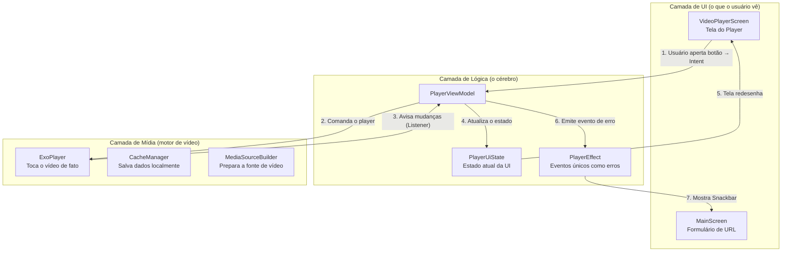

# 📱 Player de Vídeo Android — Guia Completo para Devs Júniors

> **Para quem é este guia?**
> Este documento foi escrito pensando em você que está aprendendo Android e quer entender como funciona um player de vídeo de verdade. Não assumimos que você já sabe tudo — cada conceito novo vem acompanhado de uma explicação em português simples.

---

## 📌 O que este projeto faz?

Este é um **app Android de reprodução de vídeo** (como um YouTube simplificado). Com ele você pode:

- Colar uma URL de vídeo e apertar "Reproduzir"
- Assistir vídeos em HLS ou DASH (formatos profissionais de streaming)
- Navegar entre uma lista de vídeos (playlist)
- Girar o celular e ter tela cheia automática
- Ver o progresso do carregamento e controles de play/pause/avançar

---

## 🛠️ Tecnologias Usadas

| Tecnologia | O que faz neste projeto |
|---|---|
| **Kotlin** | Linguagem de programação principal |
| **Jetpack Compose** | Cria a interface visual (telas e botões) sem XML |
| **Media3 / ExoPlayer** | Motor que realmente toca o vídeo |
| **Arquitetura MVI** | Padrão de organização do código que facilita debug e testes |
| **Material Design 3** | Sistema de design do Google (cores, tipografia, formas) |
| **OkHttp** | Biblioteca para fazer requisições HTTP com mais controle |
| **SimpleCache** | Salva partes do vídeo no celular para evitar re-baixar |

---

## ✅ Pré-requisitos

Antes de rodar o projeto, você precisa ter instalado:

- **Android Studio** (versão Ladybug 2024.2 ou mais recente — baixe em [developer.android.com/studio](https://developer.android.com/studio))
- **JDK 11** ou superior (o Android Studio já instala o JDK por padrão)
- **Android SDK 26** ou superior (Android 8.0+)
- Conhecimento básico de **Kotlin** e **Jetpack Compose**

> 💡 **Dica:** Se você nunca usou Compose antes, não entre em pânico! O Compose é como HTML, mas em Kotlin. Em vez de `<Button>`, você escreve `Button { Text("Clique aqui") }`.

---

## 🚀 Como Rodar o Projeto

1. **Abra o Android Studio**

2. **Abra o projeto:** Clique em `File > Open` e selecione a pasta `Player`

3. **Aguarde o sync do Gradle:** Uma barra de progresso vai aparecer no rodapé do Android Studio. Espere terminar (pode demorar alguns minutos na primeira vez — ele está baixando as dependências).

4. **Crie um emulador** (se não tiver um dispositivo físico):
   - Clique em `Device Manager` na barra lateral direita
   - Clique em `Create Device`
   - Escolha `Pixel 6` e Android API 33 ou superior

5. **Execute o app:** Clique no botão ▶️ verde no topo ou pressione `Shift + F10`

6. **Teste o app:**
   - Uma URL de teste já vem preenchida por padrão
   - Clique em **"Carregar e Reproduzir"**
   - O vídeo deve começar a tocar!

---

## 🎬 O que Você Vê na Tela

```
┌─────────────────────────────────────┐
│  ▶️  Player                         │  ← Barra do topo (some no landscape)
├─────────────────────────────────────┤
│                                     │
│  🔗 URL do Vídeo (HLS/DASH)   [X]  │  ← Campo de URL
│                                     │
│  Aplicar corte de duração    [OFF]  │  ← Switch opcional
│                                     │
│  [▶️ Carregar e Reproduzir]         │  ← Botão principal
│                                     │
├─────────────────────────────────────┤
│                                     │
│         ÁREA DO PLAYER              │  ← Vídeo ocupa aqui
│                                     │
│  ▶️  ◀️  ▶▶  ━━━━●━━━  01:30/05:00 │  ← Controles (somem em 3s)
└─────────────────────────────────────┘
```

No modo **paisagem** (deitado), o formulário some e o vídeo fica em tela cheia com as barras do sistema escondidas.

---

## 📁 Estrutura de Pastas

```
Player/
├── app/
│   └── src/main/
│       ├── java/br/com/player/
│       │   │
│       │   ├── MainActivity.kt          ← Ponto de entrada do app.
│       │   │                              Mostra a tela principal e gerencia o ciclo de vida.
│       │   │
│       │   ├── player/
│       │   │   ├── PlayerConfig.kt      ← "Fichas técnicas" do player.
│       │   │   │                          Define o formato dos dados (URL, cache, buffer).
│       │   │   │
│       │   │   ├── CacheManager.kt      ← Gerenciador de cache de vídeo.
│       │   │   │                          Salva dados localmente para evitar re-download.
│       │   │   │
│       │   │   ├── MediaSourceBuilder.kt ← Fábrica de fontes de mídia.
│       │   │   │                           Converte URL + configurações em algo que o
│       │   │   │                           ExoPlayer consegue reproduzir.
│       │   │   │
│       │   │   └── ui/
│       │   │       ├── PlayerViewModel.kt  ← O "cérebro" do player.
│       │   │       │                         Toda a lógica de play/pause/erro fica aqui.
│       │   │       │
│       │   │       └── VideoPlayerScreen.kt ← A tela visual do player.
│       │   │                                  Botões, barra de progresso, controles.
│       │   │
│       │   └── ui/theme/
│       │       ├── Color.kt             ← Paleta de cores do app (tema "Cinema")
│       │       ├── Type.kt              ← Tamanhos e estilos de texto
│       │       └── Theme.kt             ← Combina cores + tipografia em um tema Material 3
│       │
│       ├── res/                         ← Recursos do Android (ícones, strings)
│       └── AndroidManifest.xml          ← "Certidão de nascimento" do app para o Android
│
├── gradle/
│   └── libs.versions.toml              ← Lista centralizada de versões das bibliotecas
│
├── build.gradle.kts                    ← Configuração de build do projeto raiz
└── app/build.gradle.kts                ← Configuração de build do módulo app
                                          (SDK mínimo, dependências, etc.)
```

---

## 🏗️ Arquitetura MVI — Explicada para Júniors

### O que é MVI?

**MVI** significa **Model-View-Intent** (Modelo-Visão-Intenção). É uma forma de organizar o código para que ele seja fácil de entender e depurar.

**Analogia do restaurante:**

```
👤 Cliente (Usuário)
    ↓ faz um pedido (Intent)
🧑‍🍳 Cozinha (ViewModel)
    ↓ prepara e atualiza o status
🍽️ Prato / Cardápio (State)
    ↓ exibido para
👁️ Garçom / Tela (View)
```

No código:

```
Usuário aperta "Play"
    ↓ envia PlayerIntent.TogglePlayPause
PlayerViewModel recebe e processa
    ↓ chama player.play()
ExoPlayer muda estado → Listener notifica ViewModel
    ↓ ViewModel atualiza PlayerUiState.isPlaying = true
VideoPlayerScreen lê o estado
    ↓ troca o ícone de ▶️ para ⏸️
```

### Por que isso é bom?

- **Uma única fonte da verdade:** O estado da tela vem de um único lugar (o `PlayerUiState`). Não tem variável em um lugar e estado em outro.
- **Fácil de depurar:** Se algo está errado na tela, você vai no estado e vê o que está lá. Simples.
- **Previsível:** A tela SEMPRE reage ao estado. Não tem lógica escondida no botão.

### Diagrama do Fluxo



---

## 🔍 Componentes Core — Explicados do Zero

### 7.1 📄 `PlayerConfig.kt` — As Fichas Técnicas

Este arquivo define **como os dados são organizados** no projeto. Pense neles como formulários com campos:

```kotlin
// Configuração de um vídeo individual
data class MediaItemConfig(
    val url: String,                    // Link do vídeo (obrigatório)
    val format: MediaFormat = MediaFormat.HLS,  // Formato: HLS ou DASH (padrão: HLS)
    val clipDurationMs: Long? = null    // Duração máxima em ms (null = sem corte)
)

// HLS e DASH são os dois formatos profissionais de streaming (veja o Glossário)
enum class MediaFormat { HLS, DASH }

// Configuração do cache (quantos dados salvar localmente)
data class CacheConfig(
    val maxBytes: Long = 200L * 1024L * 1024L // 200 MB por padrão
)

// Configuração de buffer (quanto do vídeo pré-carregar)
data class BufferConfig(
    val minBufferMs: Int = 15000,   // Mínimo 15 segundos de buffer
    val maxBufferMs: Int = 50000,   // Máximo 50 segundos de buffer
    val bufferForPlaybackMs: Int = 2500,          // 2.5s para iniciar playback
    val bufferForPlaybackAfterRebufferMs: Int = 5000 // 5s após um "travamento"
)

// O pacote completo que você manda para o ViewModel carregar
data class PlayerConfig(
    val mediaList: List<MediaItemConfig>, // Lista de vídeos
    val cacheConfig: CacheConfig = CacheConfig(),
    val bufferConfig: BufferConfig = BufferConfig()
)
```

> 💡 **Por que usar data class?** Kotlin `data class` gera automaticamente `equals()`, `hashCode()` e `copy()`. O `copy()` é muito útil no MVI: `estado.copy(isPlaying = true)` cria um novo estado sem modificar o original.

---

### 7.2 🗄️ `CacheManager.kt` — O Cofre de Vídeos

**O que é cache?**
Quando você assiste um vídeo online, os dados chegam em pacotes pelo Wi-Fi/4G. O cache **guarda esses pacotes no celular**. Se você voltar para a mesma cena, não precisa baixar de novo — lê do armazenamento local. Mais rápido e economiza dados.

**Por que é um Singleton?**

> **Singleton** = uma classe que tem **apenas uma instância** em todo o app.

O `SimpleCache` do Media3 tem uma limitação: **ele trava o diretório de cache**. Se você criar duas instâncias ao mesmo tempo, o segundo vai dar erro porque o diretório já está "ocupado".

Analogia: é como uma sala de reunião com uma chave física. Só uma pessoa pode entrar por vez. O Singleton garante que você nunca vai ter dois processos tentando usar o mesmo cofre ao mesmo tempo.

```kotlin
object CacheManager { // "object" em Kotlin = Singleton automático!

    @Volatile                    // ← Veja explicação abaixo
    private var simpleCache: SimpleCache? = null

    private val lock = Any()     // Objeto usado como "cadeado"

    fun getCache(context: Context, cacheConfig: CacheConfig): SimpleCache {
        // Verificação rápida (sem travar nada)
        simpleCache?.let { return it }

        // Se chegou aqui, precisa criar. Trava para garantir segurança entre threads.
        synchronized(lock) {
            // Verifica de novo DENTRO do lock (outro thread pode ter criado enquanto esperava)
            simpleCache?.let { return it }

            // Cria o cache em app.cacheDir/mediacache
            val cacheDir = File(context.cacheDir, "mediacache")
            val evictor = LeastRecentlyUsedCacheEvictor(cacheConfig.maxBytes) // Política LRU
            val cache = SimpleCache(cacheDir, evictor)
            simpleCache = cache
            return cache
        }
    }
}
```

**O que é `@Volatile`?**
Imagine dois garçons (threads) que trabalham juntos. O garçom A atualiza o pedaço de papel do cliente. O garçom B lê o papel e pega a versão antiga porque estava com uma cópia na cabeça. `@Volatile` garante que **nenhum garçom use cópia em cache local** — todos leem sempre o papel original (memória principal).

**O que é `synchronized(lock)`?**
É a fila do banco. Quando você chega no guichê, ninguém pode entrar antes de você terminar. `synchronized` cria esse "guichê exclusivo" para que apenas um thread por vez execute aquele bloco de código.

> ⚠️ **Erro Comum:** Nunca crie `SimpleCache` direto no ViewModel ou Activity! Sempre use o `CacheManager`. Se esquecer, você vai ver um erro como `"Cache is already in use"`.

---

### 7.3 🧠 `PlayerViewModel.kt` — O Cérebro do App

**O que é um ViewModel?**
É uma classe que sobrevive à rotação da tela. Quando você gira o celular, a `Activity` é **destruída e recriada**, mas o `ViewModel` continua vivo. Isso significa que o vídeo continua de onde parou, sem precisar carregar de novo.

Analogia: pense no ViewModel como o **gerente de uma loja**. Quando o turno muda (rotação = troca de turno), o gerente continua no cargo com todo o conhecimento. Os atendentes (Activities/Composables) podem mudar, mas o gerente lembra de tudo.

#### MVI no ViewModel: Intents, State e Effects

```kotlin
// INTENTS — O que o usuário pode PEDIR
sealed class PlayerIntent {
    object TogglePlayPause : PlayerIntent()  // "Quero pausar/resumir"
    data class SeekTo(val positionMs: Long) : PlayerIntent()  // "Quero ir para 1:30"
    data class LoadMediaList(val config: PlayerConfig) : PlayerIntent()  // "Carrega esses vídeos"
    object NextItem : PlayerIntent()     // "Próximo vídeo"
    object PreviousItem : PlayerIntent() // "Vídeo anterior"
    object RetryLast : PlayerIntent()    // "Tenta de novo após erro"
}

// STATE — Como o app está agora (TODA a UI vem daqui)
data class PlayerUiState(
    val isBuffering: Boolean = false,       // Está carregando?
    val isPlaying: Boolean = false,         // Está tocando?
    val currentPositionMs: Long = 0L,       // Onde está o vídeo agora (em ms)
    val durationMs: Long = 0L,              // Duração total do vídeo
    val errorMessage: String? = null,       // Mensagem de erro (null = sem erro)
    val currentIndex: Int = 0,             // Qual vídeo da playlist está tocando
    val totalItems: Int = 0                // Total de vídeos na playlist
)

// EFFECTS — Eventos únicos (não devem se repetir ao girar a tela)
sealed class PlayerEffect {
    data class ShowErrorToast(val message: String) : PlayerEffect()  // Mostrar erro
    object OnPlaylistEnded : PlayerEffect()  // Todos os vídeos acabaram
}
```

#### StateFlow vs SharedFlow — Qual a diferença?

Esta é uma das partes mais confusas para iniciantes. Vamos simplificar:

| | `StateFlow` (uiState) | `SharedFlow` (effects) |
|---|---|---|
| **O que guarda** | O estado ATUAL | Eventos que aconteceram |
| **Ao girar a tela** | ✅ Nova tela recebe o estado atual | ❌ Evento NÃO é repetido |
| **Exemplo** | "O vídeo está em pausa em 01:30" | "O vídeo acabou" (não pode disparar de novo!) |
| **Analogia** | Placar de um jogo | Gol marcado (acontece uma vez) |

Se o evento de "fim de playlist" fosse um `StateFlow`, ao girar o celular, o app poderia tentar avançar para o próximo vídeo mais uma vez — o que causaria um bug. O `SharedFlow` previne isso.

#### Como o ViewModel decide a estratégia de carregamento

```kotlin
private fun loadMediaList(config: PlayerConfig) {
    // Automaticamente escolhe a estratégia certa:
    prefetchEnabled = config.mediaList.size > 1

    if (prefetchEnabled) {
        loadWithPreload(config)  // 2+ vídeos → usa PreloadManager (pré-carrega vizinhos)
    } else {
        loadDirect(config)       // 1 vídeo → carrega direto no ExoPlayer (mais simples)
    }
}
```

**Por que essa distinção?** O `DefaultPreloadManager` tem overhead de configuração. Para um único vídeo, é desperdício. Para playlists, ele garante que o próximo vídeo já começa a carregar enquanto você ainda assiste o atual — como o YouTube faz.

#### Estratégia de Pré-carregamento por Distância

Quando você tem uma playlist, o app decide **o quanto pré-carregar** baseado em quão longe o vídeo está do que está tocando agora:

```kotlin
override fun getTargetPreloadStatus(rankingData: Int): DefaultPreloadManager.PreloadStatus {
    val distance = abs(rankingData - currentPlayingIndex)
    return when (distance) {
        1    -> PreloadStatus.specifiedRangeLoaded(3_000L)  // Vizinho: pré-carrega 3s
        2    -> PreloadStatus.PRELOAD_STATUS_TRACKS_SELECTED // 2 de distância: escolhe faixas
        3, 4 -> PreloadStatus.PRELOAD_STATUS_SOURCE_PREPARED // 3-4: prepara o manifesto
        else -> PreloadStatus.PRELOAD_STATUS_NOT_PRELOADED  // Muito longe: não pré-carrega
    }
}
```

Analogia: é como preparar uma fila de restaurante. O próximo cliente (distância 1) já está com a mesa arrumada. O que está 2 posições atrás já escolheu o prato. Os outros estão esperando na fila.

---

### 7.4 🖥️ `VideoPlayerScreen.kt` — A Interface Visual

Este é o Composable que desenha a tela do player. Vamos entender as partes mais importantes:

#### DisposableEffect — Fechar a Torneira ao Sair

```kotlin
DisposableEffect(Unit) {
    // Este bloco roda quando o Composable ENTRA na tela

    onDispose {
        // Este bloco roda quando o Composable SAI da tela
        player.pause() // Para o vídeo para não tocar em background
    }
}
```

Analogia: é como fechar a torneira quando você sai do banheiro. Sem o `DisposableEffect`, o vídeo continuaria tocando (e consumindo bateria) mesmo depois de você fechar a tela.

> ⚠️ **Erro Comum:** Esquecer de liberar recursos no `onDispose` é uma das causas mais comuns de vazamento de memória (memory leak) em apps Android.

#### Auto-hide dos Controles

Os controles somem sozinhos após 3 segundos quando o vídeo está tocando. Funciona assim:

```
Vídeo está tocando
    ↓ após 3 segundos sem interação
Controles ficam invisíveis (animação fade out)
    ↓ usuário toca a tela
Controles aparecem (animação fade in)
    ↓ temporizador reinicia
```

#### Modo Paisagem Imersivo

Quando o usuário gira o celular para o lado, o app:
1. Detecta a orientação via `LocalConfiguration.current.orientation`
2. Esconde a barra do topo e o formulário
3. Usa `WindowInsetsControllerCompat` para esconder as barras do sistema (status bar + navigation bar)
4. O vídeo expande para ocupar a tela inteira

---

### 7.5 🏗️ `MediaSourceBuilder.kt` — A Fábrica de Vídeos

Este arquivo pega a URL e as configurações e transforma em um objeto `MediaSource` que o ExoPlayer entende.

**O que é HLS e DASH?** (Veja o Glossário no final, mas aqui vai o essencial)

| Formato | Extensão | Usado por |
|---|---|---|
| HLS | `.m3u8` | Apple, a maioria dos CDNs |
| DASH | `.mpd` | YouTube, Netflix |

Ambos funcionam da mesma forma: o vídeo é dividido em pedaços pequenos (chunks), e o player baixa chunk por chunk, adaptando a qualidade conforme a velocidade da internet.

---

## 🔄 Fluxo Completo — De A a Z

Vamos seguir o caminho de um clique no botão "Carregar e Reproduzir" até o vídeo tocar:

```
PASSO 1: Usuário digita a URL e aperta o botão
━━━━━━━━━━━━━━━━━━━━━━━━━━━━━━━━━━━━━━━━━━━
📍 Arquivo: MainActivity.kt (MainScreen composable)

O botão chama:
viewModel.handleIntent(
    PlayerIntent.LoadMediaList(
        PlayerConfig(mediaList = listOf(MediaItemConfig(url = url)))
    )
)
```

```
PASSO 2: ViewModel recebe o Intent
━━━━━━━━━━━━━━━━━━━━━━━━━━━━━━━━━━━━━━━━━━━
📍 Arquivo: PlayerViewModel.kt

fun handleIntent(intent: PlayerIntent) {
    when (intent) {
        is PlayerIntent.LoadMediaList -> loadMediaList(intent.config)
    }
}
```

```
PASSO 3: ViewModel decide a estratégia
━━━━━━━━━━━━━━━━━━━━━━━━━━━━━━━━━━━━━━━━━━━
📍 Arquivo: PlayerViewModel.kt

Como é 1 vídeo → chama loadDirect(config)
```

```
PASSO 4: MediaSourceBuilder prepara a fonte de vídeo
━━━━━━━━━━━━━━━━━━━━━━━━━━━━━━━━━━━━━━━━━━━
📍 Arquivo: MediaSourceBuilder.kt + CacheManager.kt

MediaSourceBuilder.build(app, mediaItemConfig, cacheConfig)
  → CacheManager.getCacheDataSourceFactory() (cria/reutiliza cache)
  → Cria um HlsMediaSource ou DashMediaSource com cache integrado
  → Retorna o MediaSource pronto para o ExoPlayer
```

```
PASSO 5: ExoPlayer começa a reproduzir
━━━━━━━━━━━━━━━━━━━━━━━━━━━━━━━━━━━━━━━━━━━
📍 Arquivo: PlayerViewModel.kt

player.addMediaSource(source)
player.playWhenReady = true  // Vai tocar assim que estiver pronto
player.prepare()             // Começa a baixar e decodificar
```

```
PASSO 6: ExoPlayer avisa o ViewModel via Listener
━━━━━━━━━━━━━━━━━━━━━━━━━━━━━━━━━━━━━━━━━━━
📍 Arquivo: PlayerViewModel.kt (playerListener)

onPlaybackStateChanged(STATE_BUFFERING)
  → _uiState.value = _uiState.value.copy(isBuffering = true)
  → A tela exibe a barra de carregamento no topo
```

```
PASSO 7: Vídeo começa a tocar
━━━━━━━━━━━━━━━━━━━━━━━━━━━━━━━━━━━━━━━━━━━
📍 Arquivo: PlayerViewModel.kt (playerListener)

onIsPlayingChanged(isPlaying = true)
  → _uiState.value = _uiState.value.copy(isPlaying = true, isBuffering = false)
  → Polling de posição começa (atualiza a barra de progresso a cada 500ms)
```

```
PASSO 8: VideoPlayerScreen reage ao novo estado
━━━━━━━━━━━━━━━━━━━━━━━━━━━━━━━━━━━━━━━━━━━
📍 Arquivo: VideoPlayerScreen.kt

val uiState by viewModel.uiState.collectAsState()
// Compose detecta mudança no uiState e redesenha automaticamente
// Ícone de ▶️ muda para ⏸️, barra de progresso começa a avançar
```

---

## 📖 Glossário — Termos Importantes

### ExoPlayer / Media3
**ExoPlayer** é a biblioteca de reprodução de vídeo mais usada no Android. **Media3** é a versão mais nova, mantida pelo Google junto com o Jetpack. O ExoPlayer cuida de tudo: baixar os dados, decodificar o vídeo, sincronizar o áudio, etc. Você não precisa escrever o codec — só configurar e comandar.

### HLS (HTTP Live Streaming)
Formato criado pela Apple. O vídeo é dividido em segmentos de alguns segundos. Um arquivo `.m3u8` lista todos os segmentos e as qualidades disponíveis. Quando a internet fica lenta, o player automaticamente troca para uma qualidade mais baixa.

### DASH (Dynamic Adaptive Streaming over HTTP)
Similar ao HLS, mas criado pelo MPEG. O arquivo de manifesto tem extensão `.mpd`. É o formato usado pelo YouTube e Netflix.

### MVI (Model-View-Intent)
Arquitetura onde: **Model** = os dados (estado), **View** = a tela, **Intent** = ações do usuário. O fluxo é sempre unidirecional: View → Intent → ViewModel → State → View.

### StateFlow
Um `Flow` que sempre tem um valor atual. Quem "observa" ele recebe o estado mais recente imediatamente ao se inscrever. Ideal para representar estado de UI que precisa ser lembrado (ex: posição do vídeo).

### SharedFlow
Um `Flow` sem estado. Os eventos emitidos só chegam para quem está escutando naquele momento. Ideal para eventos pontuais que não devem ser repetidos (ex: "playlist encerrou", "erro ao carregar").

### Singleton
Um padrão de design onde uma classe tem **apenas uma instância** em todo o app. Em Kotlin, basta usar `object` em vez de `class`. Usado no `CacheManager` para evitar dois processos abrindo o mesmo diretório de cache simultaneamente.

### Jetpack Compose
Framework moderno do Android para criar interfaces. Em vez de XML, você escreve funções Kotlin com anotação `@Composable`. O Compose "recompõe" (redesenha) automaticamente quando o estado muda, sem você precisar chamar `notifyDataSetChanged()` ou `invalidate()`.

### DisposableEffect
Um efeito colateral em Compose que tem um **ciclo de vida**. O código dentro dele roda quando o Composable entra na tela, e o bloco `onDispose` roda quando o Composable sai da tela. Essencial para liberar recursos (player, sensores, listeners).

### LRU (Least Recently Used)
Estratégia de cache que descarta primeiro o item acessado há mais tempo. Se o cache está cheio (200 MB) e você quer guardar mais dados, o vídeo que você assistiu há mais tempo é removido primeiro.

---

## ♻️ Como Reusar em Outro Projeto

### Carregando um único vídeo

```kotlin
// Dentro de qualquer Composable
val viewModel: PlayerViewModel = viewModel()

// Carrega e reproduz um vídeo HLS
viewModel.handleIntent(
    PlayerIntent.LoadMediaList(
        PlayerConfig(
            mediaList = listOf(
                MediaItemConfig(
                    url = "https://seu-servidor.com/video.m3u8",
                    format = MediaFormat.HLS
                )
            )
        )
    )
)

// Exibe o player na tela
VideoPlayerScreen(viewModel = viewModel)
```

### Reagindo ao Fim do Vídeo

```kotlin
// Dentro de um Composable
LaunchedEffect(Unit) {
    viewModel.effects.collect { effect ->
        when (effect) {
            is PlayerEffect.OnPlaylistEnded -> {
                // Vídeo acabou! Aqui você pode:
                // - Mostrar sugestões de outros vídeos
                // - Voltar para a tela anterior
                // - Iniciar o próximo vídeo automaticamente
                println("Todos os vídeos acabaram!")
            }
            is PlayerEffect.ShowErrorToast -> {
                // Erro ao carregar. Mostre para o usuário.
                snackbarHostState.showSnackbar(effect.message)
            }
        }
    }
}
```

### Carregando uma Playlist

```kotlin
viewModel.handleIntent(
    PlayerIntent.LoadMediaList(
        PlayerConfig(
            mediaList = listOf(
                MediaItemConfig(url = "https://exemplo.com/video1.m3u8"),
                MediaItemConfig(url = "https://exemplo.com/video2.m3u8"),
                MediaItemConfig(url = "https://exemplo.com/video3.mpd", format = MediaFormat.DASH)
            ),
            cacheConfig = CacheConfig(maxBytes = 500L * 1024L * 1024L) // 500 MB de cache
        )
    )
)
```

---

## 💡 Decisões de Projeto — Por Que Foi Feito Assim?

### Por que MVI e não MVVM?

**MVVM** (o padrão mais comum) usa `LiveData` e `ViewModel`, mas o estado pode vazar entre múltiplos `LiveData`. No **MVI**, tudo é um único `uiState`. Se a tela precisa de qualquer dado, ele está no `uiState`. Isso elimina a "dessincronização" entre variáveis (ex: `isLoading = true` mas `error != null` ao mesmo tempo, o que é contraditório).

### Por que `AndroidViewModel` e não `ViewModel` simples?

`AndroidViewModel` recebe o `Application` context. O `ExoPlayer` e o `SimpleCache` precisam de um `Context` para funcionar. O `Application` context é seguro para ser guardado no ViewModel (não vaza como o `Activity` context), pois ele dura o mesmo tempo que o app.

### Por que `configChanges` no AndroidManifest?

```xml
<activity
    android:name=".MainActivity"
    android:configChanges="orientation|screenSize|smallestScreenSize|screenLayout">
```

Sem isso, girar o celular **destrói e recria** a `Activity`. O Android mata o processo de vídeo, reinicia do zero e você ouve aquele "clique" chato de reinício de vídeo.

Com `configChanges`, a Activity **não é destruída** na rotação. O ViewModel (e o ExoPlayer dentro dele) sobrevivem. A UI só se reorganiza para o modo paisagem.

> ⚠️ **Isso não é para todos os casos!** `configChanges` funciona bem aqui porque o Compose e o ViewModel gerenciam estado corretamente. Em apps com XML+Fragments, pode causar bugs se você não souber o que está fazendo.

### Por que o `SimpleCache` precisa ser Singleton?

O `SimpleCache` usa um `DatabaseProvider` que **tranca o arquivo de banco de dados do cache**. Criar duas instâncias apontando para o mesmo diretório gera um `CacheDatabaseProvider` exception imediatamente. O Singleton garante que só um processo acessa o cofre por vez.

---

## 🏁 Próximos Passos para Aprender Mais

Se você quer se aprofundar nos tópicos usados aqui, estes são os recursos oficiais:

- **Jetpack Compose:** [developer.android.com/jetpack/compose](https://developer.android.com/jetpack/compose)
- **Media3 / ExoPlayer:** [developer.android.com/media/media3](https://developer.android.com/media/media3)
- **Arquitetura Android (MVI/MVVM):** [developer.android.com/topic/architecture](https://developer.android.com/topic/architecture)
- **Kotlin Flows (StateFlow/SharedFlow):** [kotlinlang.org/docs/flow.html](https://kotlinlang.org/docs/flow.html)
- **Material Design 3:** [m3.material.io](https://m3.material.io)

---

*Feito com ❤️ para devs que estão aprendendo Android do jeito certo.*
